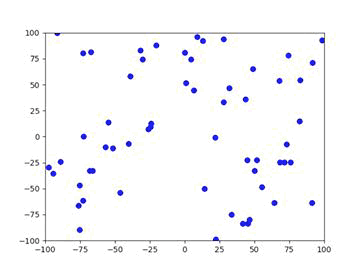

# WorkShop1-USFQ
# Taller 1 de Inteligencia Artificial

- **Nombre del grupo**: Grupo-1
- **Integrantes del grupo**:
  * Loor Párraga, Ricardo
  * Muenala Terán, Kuntur
  * Villacreses Zúñiga, Diego
  * Viteri Puyol, Santiago

- **Link**: [Planificación en ClickUp](https://doc.clickup.com/9013102272/d/h/8ckj1p0-33/60b3769cbaa9388)

# Taller 2 de Inteligencia Artificial

- **Integrantes del grupo con descripción de sus tareas**:
  * Santiago Viteri: 
    * Elaboración de algoritmos para ejercicios 1 y 2
  * Ricardo Loor: 
    * Re factorization código y documentación ejercicio 1. 
  * Diego Villacreses: 
    * Pruebas robustez código y simulaciones ejercicio 2.
  * Kuntur Muenala:
    * Revisión de literatura y documentación ejercicio 2.

## Problema 1: Uso de Algoritmos de Búsqueda

Se utilizarán varios algoritmos de búsqueda no informados para la solución de laberintos. A continuación se presenta los resultados encontrados por cada algoritmo. Adicionalmente se analiza cada algoritmos bajo las siguientes métricas: tiempo de ejecución y número de nodos en la solución.

### Study Case 1

#### Tiempos de ejecucion y numero de nodos

### Study Case 2

#### Tiempos de ejecucion y numero de nodos

### Study Case 3

#### Tiempos de ejecucion y numero de nodos

#### Conclusiones

Como se puede observar, los resultados obtenidos al comparar los algoritmos de búsqueda en el laberinto indican que A* exhibe tiempos de ejecución más prolongados en relación con BFS y DFS en todos los casos. Esto se debe a que A* utiliza una heurística para encontrar la solución óptima. 

Por otro lado, DFS visita más nodos en comparación con los otros algoritmos debido a su enfoque de búsqueda profunda, sin garantizar lo localización de un óptimo global (cómo es particularmente notorio en el laberinto 3). Aunque A* y BFS tienden a visitar una cantidad similar de nodos, BFS permite encontrar un óptimo global pero puede ser computacionalmente inviable, mientras que A* se destaca para encontrar óptimos locales. 

Además, Greedy Best-First Search (GBFS) muestra tiempos de ejecución más bajos que A*, pero puede no garantizar la óptima solución, lo que sugiere que es una opción viable cuando la optimización no es crítica y se necesita una solución rápida. 

En conclusión, la selección del algoritmo depende de los requisitos específicos del problema, como la necesidad de optimización, el tiempo de ejecución tolerado y los recursos computacionales disponibles.

## Problema 2: Optimización de Colonias de Hormigas

Ant Colony Optimization (ACO) es una técnica de optimización inspirada en el comportamiento de las hormigas reales cuando buscan recursos para su colonia. El propósito de este algoritmo en el campo de la IA es el de simular el comportamiento de las hormigas para encontrar el mejor camino desde el nido de la colonia a la fuente de recursos.

### A. Implementación Planteada
En `./Taller2/P2/P2_ACO.py` se presenta una implentación de este algoritmo para un problema simple. Se puede observar los resultados a continuación:
* Solución a Caso de Estudio 1

* Solución a Caso de Estudio 2

### B. ¿Qué ocurre con el segundo caso de estudio?
1. ¿Es suficiente elegir el camino con el menor tamaño?

No, un camino de menor tamaño dada la distancia Euclideanea atravezaría los obstáculos, lo cual no está permitido. Por ello se prefieren algoritmos en los que se puedan incluir la posiblidad de obstáculos complejos. ACO resulta ser útil en este escenario, aunque una revisión de literatura más extensa sobre sus fortalezas y debilidades se debería realizar.

2. Efectos del cambio de hyperparámetros.

Se utiliza el segundo caso de estudio para realizar simulaciones. Los siguiente parámetros serán fijos a menos que se describa lo contrario: i) total de iteraciones = 100, ii) total de hormigas = 10, iii) tasa de evaporación de la feromona = 0.1, iv) $\alpha = 0.1$, v) $\beta = 15$. Para cada escenario se computan solamente 25 simulaciones por restricciones de capacidad computacional.

* Simulaciones sobre total de hormigas

El tiempo de ejecución aumenta de 0.5 segundos por simulación a 3.5 al cambiar de 5 a 40 hormigas. Considérese que solamente se realizan 25 simulaciones, por lo cual las diferencias en la distancia euclideanea promedio entre diferentes valores de totales de hormigas podrían no ser estadísticamente significativas. Aparentemente al aumentar el total de hormigas se tiene peores soluciones, lo cual resulta ser contraintuitivo. Más simulaciones y pruebas de hipótesis formales se requieren para comprobar estos resultados. De todas formas, considerando que cada cuadrado tiene una dimensión de una unidad, el peor escenario es 11.2, y el mejor es 10.2, significa que para este caso simple el total de hormigas tiene un efecto de máximo un cuadrado de pérdida, lo cual se podría considerar irrelevante. Estas conclusiones deben ser probadas contra problemas más complejos.

* Simulaciones sobre $\alpha$

El parámetro $\alpha$ puede encontrarse entre 0 a 1. Para este problema se encuentra que tanto ruta óptima como tiempo de ejecución tienen varaciones probablemente dentro del margen de error estadístico,

* Simulaciones sobre $\beta$

Se han probado valores del parámetro $\beta$ entre 1 a 30. Para este problema se encuentra que parámetros menores a 15 presentan un importante aumento en la distancia de las rutas encontradas, tambien se encuentra un pequeño pero relevante incremente en el tiempo de ejecución para $\beta$ menores a 15. A partir de 15 no se observan diferencias importantes en ruta ni tiempo de ejecución.

* Simulaciones sobre Tasa de Evaporación

La Tasa de Evaporación puede encontrarse entre 0 a 1. Para este problema se encuentra que tanto ruta óptima como tiempo de ejecución tienen varaciones probablemente dentro del margen de error estadístico,

* Conclusiones

Para este problema en particular sólamente se ha encontrado que valores bajos del parámetro $\beta$ afectan gravemente a la mejor ruta encontrada. El total de hormigas afecta importantemente al tiempo de ejecución, $\beta$ tiene un impacto pequeño pero posiblemente importante en el tiempo de ejecución. El resto de parámetros no presenta efectos importantes en ruta óptima ni tiempo de ejecución. Simulaciones adicionales en problemas más complejos se sugieren. Revisión de literatura tal vez apunte a que no existe un grupo de hyperparámetros óptimos para todos los problemas, y se deba hacer cierta búsqueda de los mismos para cada problema.

### C. Describir los parámetros del modelo
¿Qué propósito tiene cada parámetro en el modelo?

* start = Es el punto inicial (x,y) donde empieza el camino que las hormigas deben recorrer a buscar.
* end = Es la posición de destino o final (x,y) del camino que las hormigas deben alcanzar.
* obstacles = Es una lista de coordenadas que representan las posiciones de los obstáculos en el laberinto, donde las hormigas no pueden cruzar.
* grid_size = Es una tupla que especifica las dimensiones del tablero de búsqueda donde las hormigas se mueven.
* num_ants = Deterimna el numero de hormigas que el algoritmo toma para realizar la busqueda. Cuantas más hormigas haya, más exploración del espacio de búsqueda se realizará, lo que puede aumentar las posibilidades de encontrar una solución óptima.
* evaporation_rate = Representa la tasa de evaporizacion de las feromonas depositadas en el camino de las hormigas. Controla la velocidad a la que las feromonas disminuyen con cada iteracion. Por lo que este parametro afecta la capacidad del algoritmo para converger hacia una solucion optima.
* alpha = Es un parámetro que controla la influencia de las feromonas en la elección del próximo movimiento de una hormiga. Un valor más alto de alpha da más peso a las feromonas en la selección del siguiente paso.
* beta = Determina la influencia de la heurística (distancia) en la elección del próximo movimiento de una hormiga. Un valor más alto de beta prioriza la distancia en la selección del siguiente paso sobre las feromonas.
* pheromones = el valor de pheromonas que queda marcado el tablero al comienzo de la busqueda. (todas las posiciones tienen igual valor de feromona al inicio del algoritmo = 1)
best_path = Es una lista de valores de tuplas (x,y) que muestran el mejor camino marcado por las feromonas.

### D. Descripcion del modelo

1. **Inicialización**: Se crea una clase llamada AntColonyOptimization que toma como entrada el punto de inicio, el punto final, los obstáculos, el tamaño de la cuadrícula, el número de hormigas, la tasa de evaporación de feromonas, y los parámetros alpha y beta.

2. **Exploración de vecindario**: La función _get_neighbors calcula los vecinos válidos de una posición dada en la cuadrícula, excluyendo los obstáculos y las posiciones fuera de la cuadrícula.

3. **Selección del próximo movimiento**: La función _select_next_position selecciona el próximo movimiento de una hormiga en función de las feromonas depositadas y una heurística que tiene en cuenta la distancia al punto final.

Esta heurística tiene como objetivo guiar a las hormigas hacia las posiciones que están más cerca del punto final en la cuadrícula, lo que ayuda a explorar y explotar el espacio de búsqueda de manera más efectiva:

$$ \text{heuristic} = \dfrac{1}{\sqrt{(x_{neighbor} - x_{end})^2 + (y_{neighbor} - y_{end})^2} + 0.1}$$

La heuristica ayuda a calcular la probabilidad de visitar la siguiente posicion vecina, de esta manera las hormigas tienen más probabilidades de seleccionar movimientos que las acercan al destino en lugar de alejarlas del destino:

$$ \text{Probabilidad} = \text{pheromone}^{\alpha} \cdot \text{heuristic}^{\beta} $$

4. **Depositar feromonas**: La función _deposit_pheromones deposita feromonas en las posiciones visitadas por una hormiga.

5. **Evaporación de feromonas**: La función _evaporate_pheromones simula la evaporación gradual de feromonas en todas las posiciones de la cuadrícula.

6. **Búsqueda de la mejor ruta**: La función find_best_path itera sobre un número especificado de iteraciones, en cada una de las cuales varias hormigas exploran el entorno y depositan feromonas. En cada iteración, se actualiza el camino óptimo encontrado hasta el momento.

7. **Visualización**: La función plot se encarga de visualizar la cuadrícula con las feromonas depositadas, el punto de inicio, el punto final y el mejor camino marcado por las feromonas de las hormigas.

### E. Pregunta de investigación: ¿Se puede utilizar este algoritmo para resolver el Travelling Salesman Problema (TSP)?

Si, el agoritmo de busqueda *Ant Colony Optimization* (ACO) puede usarse para dar una solucion optima para el TSP, no seria la mejor solucion sin embargo su solucion dada seria bastante buena.

El algoritmo de busqueda deposita una cantidad de feromonas inicial en cada arista de busqueda del grafo del TSP y crea hormigas virtuales moviendose de una ciudad a otra segun las reglas de porbabilidad del algoritmo.

En cada iteración, cada hormiga se coloca aleatoriamente en una ciudad, del conjunto de las ciudades. Esa ciudad será el punto de partida del recorrido que construirá la hormiga. Una solución al TSP puede estar representada por un conjunto de ciudades consecutivas. Por tanto, en cada paso de la construcción la hormiga tiene que elegir, con una probabilidad determinada, la siguiente ciudad a la que viajar [1]. 

En cada paso, la hormiga selecciona su proximo movimiento basandose en la cantidad de feromona depositada en las aristas y usa una heuristica que tiene en cuenta la distancia entre las ciudades. Despues de completar su recorrido, cada hormiga deposita feromonas en las aristas que ha recorrido, con una cantidad proporcional a la calidad de su camino solucion. En cada iteracion las feromonas se evaporan en todas las aristas para evitar el estancamiento del algoritmo y promover la exploracion del espacio de búsqueda [2,3].

El algoritmo de optimización por colonia de hormigas se puede utilizar efectivamente para buscar soluciones al Problema del Viajante, y de hecho, se ha convertido en uno de los más populares y efectivos para este problema. El algoritmo ha sido muy efectivo para soluciones de búsqueda que ha tenido algunas variantes y mejoras para la eficiencia de sus resultados, alguno de estos algoritmos son: *ACS (Ant Colony System)* y *MMAS (Max-Min Ant System)* [2].

1. Monteiro, M. Fontes, D. Fontes, F. (2012). *Ant Colony Optimization: a literature survey*. FEP WORKING PAPERS. [link](https://core.ac.uk/download/pdf/143395869.pdf)

2. Wang, Y. (2021). *Ant colony optimization for traveling salesman problem based on parameters optimization*. Applied soft computing, ELSEVIER. [link](https://www.sciencedirect.com/science/article/abs/pii/S1568494621003628)

3. Stutzle, T.,Lopez, M. Dorigo, M. (2011). *A Concise Overview of Applications of Ant Colony Optimizatio*. [link](chrome-extension://efaidnbmnnnibpcajpcglclefindmkaj/https://lopez-ibanez.eu/doc/StuLopDor2010aco-applications.pdf)

# Taller 3 de Inteligencia Artificial

