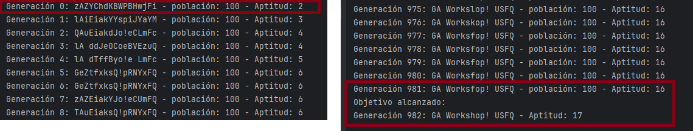
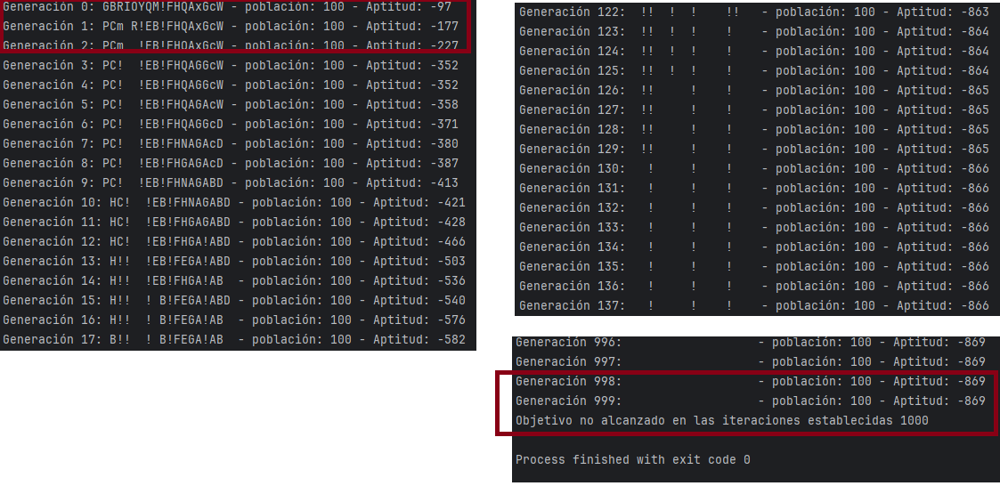
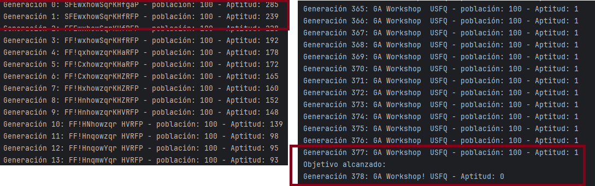
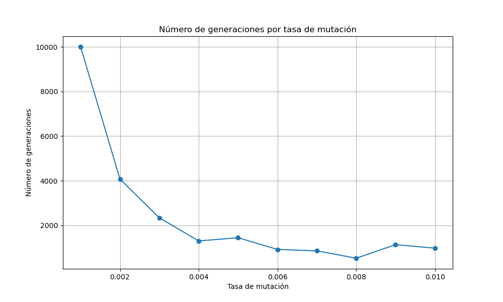
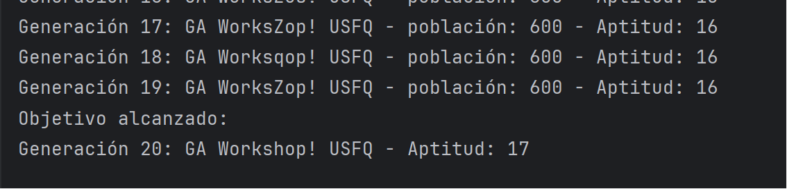

# WorkShop-USFQ
## Taller 4 de inteligencia artificial

- **Nombre del grupo**: G5
- **Integrantes del grupo**:
  * Felipe Toscano
  * José Asitimbay
  * Brayan Lechón
  * Christian Hernandez

**Participación en el taller:**
  * **Felipe Toscano**: Participacion el la 
    resolucion del código y la redacción del 
    literal 3
  * **José Asitimbay**: Participacion el la 
    resolucion del código y la redacción del 
    literal 5 
  * **Brayan Lechón**: Participacion el la 
    resolucion del código y la redacción del 
    literal 1,2,3 
  * **Christian Hernandez**: Participacion el la 
    resolucion del código y la redacción del 
    literal 6 y 7 


## ALGORTIMOS GENÉTICOS
El taller contine el código para la ejecución 
de un Algoritmo Genético, el objetivo de este algoritmo es llegar a generar la frase objetivo: “GA Workshop! USFQ” que tiene 17 letras. El
proceso de generación lo realizará a partir de 
una población de 100 frases aleatorias (individuos) de tamaño de 17 letras. Las poblaciones generadas deberán interactuar cada una
hasta llegar a producir la frase objetivo. Una 
vez alcanzado un individuo que sea igual a la frase objetivo, el algoritmo genético se detendrá.
Posibles resultados de ejecución:
1. El algoritmo llega a producir el individuo deseado en el número de interacciones que se le
ha definido, en este caso, el algoritmo ha convergido a una solución óptima.
2. El algoritmo no logra producir el individuo deseado en el número de interacciones que se
le ha definido, en este caso ocurren dos 
   situaciones: 
a) el algoritmo puede que este cerca del objetivo y le falta más iteraciones para llegar a una solución óptima, 
b) el algoritmo nunca puede converger y en lugar de acercarse al objetivo se aleja.


## Resolucion
1. Ejecute los dos casos de estudio y explique los resultados de ejecución de cada caso de
estudio.


### Caso de Estudio 1

El primer caso de estudio, establece una tasa 
de mutación de 0.01 y un número de iteraciones 
de 1000.


Al inicio de la ejecucion del codigo se puede 
apreciar la generacion de los individuos con 
cadenas de caracteres randomicas y sus 
repectivos valores de aptitud. La aptitud va 
incrementando en cada iteracion. Hasta que 
llega a la iteracion o generacion 982,donde la 
cadena de caracteres coincide exactamente con 
el objetivo.



### Caso de Estudio 2
Al incio de la ejecucion del codigo se puede 
apreciar que de igual forma que al caso de 
estudio 1, se genera una cadena randomica de 
caracteres que se va modificando en cada 
iteracion. Pero en este caso el algoritmo alcanza un punto donde la aptitud no mejora más y permanece constante a lo largo de muchas generaciones




2. ¿Cuál sería una posible explicación para que el caso 2 no finalice como lo hace el caso 1?
Revisar el archivo util.py función distance.

La función distance en el archivo util.py es la siguiente:


```python

def distance(list1:List[int], list2:List[int]):
    acc = 0
    for e1, e2 in zip(list1, list2):
        acc += (e1 - e2)
    n_size = min(len(list1), len(list2))
    if n_size == 0:
        return None
    return acc + (len(list1) - len(list2))

```
Al revisar el codigo el problema surge porque 
la suma de diferencias puede dar lugar a cancelaciones. Es decir, si hay una diferencia positiva en un par de elementos y una diferencia negativa del mismo valor en otro par, se cancelarán entre sí, resultando en una acumulación (acc) que no refleja las diferencias reales entre los dos individuos.


Dado esto, si la función distance se usa como la función de aptitud en el algoritmo genético (para minimizar la distancia a un objetivo), puede estar dando lugar a una situación en la que los individuos no están siendo correctamente evaluados en cuanto a qué tan cerca están realmente del objetivo, ya que algunas diferencias pueden estar cancelándose entre sí.

En los resultados de ejecución proporcionados, parece que el algoritmo llega a un punto en el que no puede mejorar la aptitud (o la distancia) más allá de un cierto valor, probablemente debido a esta cancelación de diferencias. Esto podría explicar por qué la aptitud no mejora a pesar de muchas generaciones: el algoritmo puede estar seleccionando individuos que no son realmente mejores, solo porque su suma acumulada de diferencias parece menor debido a las cancelaciones mencionadas.

3. Realice una correcta implementación para 
   obtener la distancia/diferencia correcta entre dos individuos en el archivo util.py función distance.

Para corregir este fenómeno, se deberia 
modificar el como se calcula la diferencia 
entre las cadenas de caracteres. Para este 
caso se el valor absoluto de la diferencia.
    
```python
acc += abs(e1 - e2)
```
Esto aseguraría que todas las diferencias se acumulan de manera que reflejan la verdadera distancia entre los individuos y el objetivo deseado.


A continuacion, se muestra el resultado de la 
ejecucion con el cambio propuesto.




4. ¿Sin alterar el parámetro de mutación mutation_rate, se puede implementar algo para
mejorar la convergencia y que esta sea más rápida? Implemente cualquier mejora que
permita una rápida convergencia. Pista: ¿Tal vez elegir de manera diferente los padres?
¿Realizar otro tipo de mutación o cruce?

Se ha seleccionado la implementación de elitismo para realizar comparaciones y validar sus beneficios con respecto a la implementación previamente presentada. El principal beneficio del elitismo es que previene la pérdida de las mejores soluciones encontradas. Esto es especialmente importante en problemas donde encontrar una solución óptima o cercana al óptimo es complicado y puede ser fácilmente perdida debido a la aleatoriedad inherente a los operadores genéticos.

Para medir la eficacia de la implementación, se ejecutan 50 veces las soluciones para obtener una comparación estadística de los resultados y evidenciar si existe una mejora significativa. Esta comparación se realiza una vez que se ha demostrado que ambas funciones convergen (case_study_1 y conv_elitismo). En el caso del elitismo, se ha tomado un valor de 0.1, como es comúnmente utilizado.

Se evidencia una mejora en los tiempos, y los resultados son los siguientes, lo que indica que el uso de elitismo mejora el tiempo:

case_study_1: Tiempo promedio = 1.3886s, Desviación estándar = 0.0890
conv_elitismo: Tiempo promedio = 0.4579s, Desviación estándar = 0.2217


5. Cree un nuevo caso de estudio 3. Altere el parámetro de mutación mutation_rate, ¿ha beneficiado en algo la convergencia? Qué valores son los más adecuados para este
parámetro. ¿Qué conclusión se puede obtener de este cambio?



| mutation_rate | n_generation |
|---------------|--------------|
| 0.001         | 10000        |
| 0.002         | 4075         |
| 0.003         | 2340         |
| 0.004         | 1305         |
| 0.005         | 1449         |
| 0.006         | 925          |
| 0.007         | 861          |
| 0.008         | 531          |
| 0.009         | 1138         |
| 0.010         | 982          |

La alteriacion del parametro mutation_rate si beneficia en la convergencia, ya que a medida que el valor de mutation_rate disminuye, el numero de generaciones disminuye.
Se determino el valor optimo de mutation_rate en 0.008, ya que es el valor que menos generaciones necesito para llegar a la frase objetivo.
desde el valor inicial 0.01 hasta 0.008 se puede observar que el numero de generaciones disminuye, pero a partir de 0.008 el numero de generaciones aumenta.
El numero de generwciones baja debido a que la probabilidad de mutacion es menor, por lo que se mantiene la poblacion original por mas tiempo, y se generan menos mutaciones, lo que permite que la poblacion converga mas rapido.


6. Cree un nuevo caso de estudio 4. Altere el tamaño de la población, ¿es beneficioso o no
aumentar la población?
Como se puede observar que al aumentar la population vemos que el número de generaciones disminuye y converge más rápidamente.


Aquí vemos la performance en tiempo y número de generations para diferentes tamaños de población.


| population_size | n_generations | execution_time |
|-----------------|---------------|----------------|
|             100 |            93 |       0.159570 |
|             200 |           119 |       0.421872 |
|             300 |            36 |       0.197471 |
|             400 |            21 |       0.155585 |
|             500 |            20 |       0.176497 |
|             600 |            19 |       0.207475 |
|             700 |            16 |       0.200449 |
|             800 |            30 |       0.441833 |
|             900 |            22 |       0.367986 |


7. De todo lo aprendido, cree el caso de estudio definitivo (caso de estudio 5) el cual tiene lo
mejor de los ítems 4, 5, 6.

Se crea un caso de estudio 7 donde se toman los mejores hiperparametros de los anteriores puntos


mutation_rate = 0.008


population_size = 600


Se ocupo la nueva clase GAENHANCED que ocupa los metodos de elitismo para determinar las nuevas generaciones
elitiismo = 0.1

