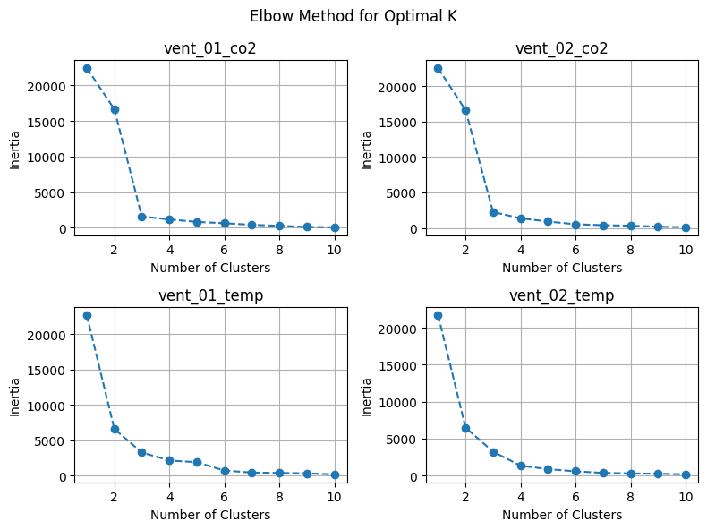
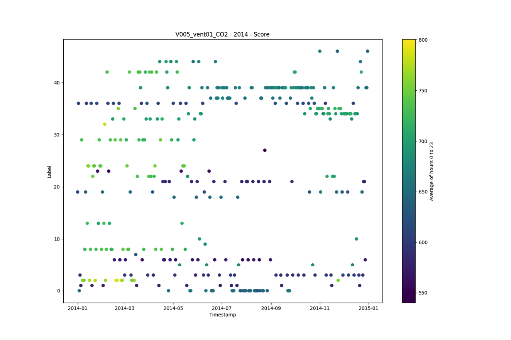

# WorkShop1-USFQ

# Tabla de Contenidos
- [Taller 1](#taller-1)
- [Taller 2](#taller-2)
  - [Problema 1: Uso de Algoritmos de Búsqueda](#problema-1-uso-de-algoritmos-de-búsqueda)
    - [Study Case 1](#study-case-1)
      - [Tiempos de ejecucion y numero de nodos](#tiempos-de-ejecucion-y-numero-de-nodos)
    - [Study Case 2](#study-case-2)
      - [Tiempos de ejecucion y numero de nodos](#tiempos-de-ejecucion-y-numero-de-nodos-1)
    - [Study Case 3](#study-case-3)
      - [Tiempos de ejecucion y numero de nodos](#tiempos-de-ejecucion-y-numero-de-nodos-2)
      - [Conclusiones](#conclusiones)
  - [Problema 2: Optimización de Colonias de Hormigas](#problema-2-optimización-de-colonias-de-hormigas)
    - [A. Implementación Planteada](#a-implementación-planteada)
    - [B. ¿Qué ocurre con el segundo caso de estudio?](#b-qué-ocurre-con-el-segundo-caso-de-estudio)
    - [C. Describir los parámetros del modelo](#c-describir-los-parámetros-del-modelo)
    - [D. Descripcion del modelo](#d-descripcion-del-modelo)
    - [E. Pregunta de investigación: ¿Se puede utilizar este algoritmo para resolver el Travelling Salesman Problema (TSP)?](#e-pregunta-de-investigación-se-puede-utilizar-este-algoritmo-para-resolver-el-travelling-salesman-problema-tsp)
- [Taller 3](#taller-3)
  - [Problema 1: Uso de Aprendizaje No Supervisado](#problema-1-uso-de-aprendizaje-no-supervisado)
    - [A. Plotear Variables](#a-plotear-variables)
    - [B. Patrones - Análisis univariable](#b-patrones---análisis-univariable)
    - [C. Anomalías – Análisis univariable](#c-anomalías--análisis-univariable)
    - [D Patrones – Análisis multivariable](#d-patrones--análisis-multivariable)
    - [Anomalías – Análisis multivariable](#anomalías--análisis-multivariable)
    - [Conclusiones](#conclusiones-1)
        - [Cluster del Análisis univariado en data principal](#cluster-del-análisis-univariado-en-data-principal)
        - [Cluster del Análisis Multivariado en data principal](#cluster-del-análisis-multivariado-en-data-principal)
  - [Problema 2: Investigación Operativa, el problema TSP](#problema-2-investigación-operativa-el-problema-tsp)
    - [A. Analizar el código propuesto](#a-analizar-el-código-propuesto)
    - [B. Analizar el parámetro tee](#b-analizar-el-parámetro-tee)
    - [C. Aplicar heurística de límites a la función objetivo](#c-aplicar-heurística-de-límites-a-la-función-objetivo)
    - [D. Aplicar heurística de vecinos cercanos](#d-aplicar-heurística-de-vecinos-cercanos)
    - [E. Conclusiones](#e-conclusiones)
    - [F. Opcional](#f-opcional)
- [Taller 4](#taller-4)
  - [A. Encontrar patrones uni-variable](#a-encontrar-patrones-uni-variable)
    - [Simulaciones](#simulaciones)
    - [Datos Reales](#datos-reales)
  - [B. Conclusiones](#b-conclusiones)
  - [Revisión Bibliográfica](#revisión-bibliográfica)


# Taller 1
[Back to Top](#tabla-de-contenidos)

- **Nombre del grupo**: Grupo-1
- **Integrantes del grupo**:
  * Loor Párraga, Ricardo
  * Muenala Terán, Kuntur
  * Villacreses Zúñiga, Diego
  * Viteri Puyol, Santiago

- **Link**: [Planificación en ClickUp](https://doc.clickup.com/9013102272/d/h/8ckj1p0-33/60b3769cbaa9388)


# Taller 2
[Back to Top](#tabla-de-contenidos)


- **Integrantes del grupo con descripción de sus tareas**:
  * Santiago Viteri: 
    * Elaboración de algoritmos para ejercicios 1 y 2
  * Ricardo Loor: 
    * Re factorization código y documentación ejercicio 1. 
  * Diego Villacreses: 
    * Pruebas robustez código y simulaciones ejercicio 2.
  * Kuntur Muenala:
    * Revisión de literatura y documentación ejercicio 2.

## Problema 1: Uso de Algoritmos de Búsqueda
[Back to Top](#tabla-de-contenidos)

Se utilizarán varios algoritmos de búsqueda no informados para la solución de laberintos. A continuación se presenta los resultados encontrados por cada algoritmo. Adicionalmente se analiza cada algoritmos bajo las siguientes métricas: tiempo de ejecución y número de nodos en la solución.

### Study Case 1


#### Tiempos de ejecucion y numero de nodos


### Study Case 2


#### Tiempos de ejecucion y numero de nodos


### Study Case 3


#### Tiempos de ejecucion y numero de nodos


#### Conclusiones

Como se puede observar, los resultados obtenidos al comparar los algoritmos de búsqueda en el laberinto indican que A* exhibe tiempos de ejecución más prolongados en relación con BFS y DFS en todos los casos. Esto se debe a que A* utiliza una heurística para encontrar la solución óptima. 

Por otro lado, DFS visita más nodos en comparación con los otros algoritmos debido a su enfoque de búsqueda profunda, sin garantizar lo localización de un óptimo global (cómo es particularmente notorio en el laberinto 3). Aunque A* y BFS tienden a visitar una cantidad similar de nodos, BFS permite encontrar un óptimo global pero puede ser computacionalmente inviable, mientras que A* se destaca para encontrar óptimos locales. 

Además, Greedy Best-First Search (GBFS) muestra tiempos de ejecución más bajos que A*, pero puede no garantizar la óptima solución, lo que sugiere que es una opción viable cuando la optimización no es crítica y se necesita una solución rápida. 

En conclusión, la selección del algoritmo depende de los requisitos específicos del problema, como la necesidad de optimización, el tiempo de ejecución tolerado y los recursos computacionales disponibles.

## Problema 2: Optimización de Colonias de Hormigas
[Back to Top](#tabla-de-contenidos)

Ant Colony Optimization (ACO) es una técnica de optimización inspirada en el comportamiento de las hormigas reales cuando buscan recursos para su colonia. El propósito de este algoritmo en el campo de la IA es el de simular el comportamiento de las hormigas para encontrar el mejor camino desde el nido de la colonia a la fuente de recursos.

### A. Implementación Planteada
En `./Taller2/P2/P2_ACO.py` se presenta una implentación de este algoritmo para un problema simple. Se puede observar los resultados a continuación:
* Solución a Caso de Estudio 1

* Solución a Caso de Estudio 2


### B. ¿Qué ocurre con el segundo caso de estudio?
1. ¿Es suficiente elegir el camino con el menor tamaño?

No, un camino de menor tamaño dada la distancia Euclideanea atravezaría los obstáculos, lo cual no está permitido. Por ello se prefieren algoritmos en los que se puedan incluir la posiblidad de obstáculos complejos. ACO resulta ser útil en este escenario, aunque una revisión de literatura más extensa sobre sus fortalezas y debilidades se debería realizar.

2. Efectos del cambio de hyperparámetros.

Se utiliza el segundo caso de estudio para realizar simulaciones. Los siguiente parámetros serán fijos a menos que se describa lo contrario: i) total de iteraciones = 100, ii) total de hormigas = 10, iii) tasa de evaporación de la feromona = 0.1, iv) $\alpha = 0.1$, v) $\beta = 15$. Para cada escenario se computan solamente 25 simulaciones por restricciones de capacidad computacional.

* Simulaciones sobre total de hormigas


El tiempo de ejecución aumenta de 0.5 segundos por simulación a 3.5 al cambiar de 5 a 40 hormigas. Considérese que solamente se realizan 25 simulaciones, por lo cual las diferencias en la distancia euclideanea promedio entre diferentes valores de totales de hormigas podrían no ser estadísticamente significativas. Aparentemente al aumentar el total de hormigas se tiene peores soluciones, lo cual resulta ser contraintuitivo. Más simulaciones y pruebas de hipótesis formales se requieren para comprobar estos resultados. De todas formas, considerando que cada cuadrado tiene una dimensión de una unidad, el peor escenario es 11.2, y el mejor es 10.2, significa que para este caso simple el total de hormigas tiene un efecto de máximo un cuadrado de pérdida, lo cual se podría considerar irrelevante. Estas conclusiones deben ser probadas contra problemas más complejos.

* Simulaciones sobre $\alpha$


El parámetro $\alpha$ puede encontrarse entre 0 a 1. Para este problema se encuentra que tanto ruta óptima como tiempo de ejecución tienen varaciones probablemente dentro del margen de error estadístico,

* Simulaciones sobre $\beta$


Se han probado valores del parámetro $\beta$ entre 1 a 30. Para este problema se encuentra que parámetros menores a 15 presentan un importante aumento en la distancia de las rutas encontradas, tambien se encuentra un pequeño pero relevante incremente en el tiempo de ejecución para $\beta$ menores a 15. A partir de 15 no se observan diferencias importantes en ruta ni tiempo de ejecución.


* Simulaciones sobre Tasa de Evaporación


La Tasa de Evaporación puede encontrarse entre 0 a 1. Para este problema se encuentra que tanto ruta óptima como tiempo de ejecución tienen varaciones probablemente dentro del margen de error estadístico,

* Conclusiones

Para este problema en particular sólamente se ha encontrado que valores bajos del parámetro $\beta$ afectan gravemente a la mejor ruta encontrada. El total de hormigas afecta importantemente al tiempo de ejecución, $\beta$ tiene un impacto pequeño pero posiblemente importante en el tiempo de ejecución. El resto de parámetros no presenta efectos importantes en ruta óptima ni tiempo de ejecución. Simulaciones adicionales en problemas más complejos se sugieren. Revisión de literatura tal vez apunte a que no existe un grupo de hyperparámetros óptimos para todos los problemas, y se deba hacer cierta búsqueda de los mismos para cada problema.


### C. Describir los parámetros del modelo
¿Qué propósito tiene cada parámetro en el modelo?

* start = Es el punto inicial (x,y) donde empieza el camino que las hormigas deben recorrer a buscar.
* end = Es la posición de destino o final (x,y) del camino que las hormigas deben alcanzar.
* obstacles = Es una lista de coordenadas que representan las posiciones de los obstáculos en el laberinto, donde las hormigas no pueden cruzar.
* grid_size = Es una tupla que especifica las dimensiones del tablero de búsqueda donde las hormigas se mueven.
* num_ants = Deterimna el numero de hormigas que el algoritmo toma para realizar la busqueda. Cuantas más hormigas haya, más exploración del espacio de búsqueda se realizará, lo que puede aumentar las posibilidades de encontrar una solución óptima.
* evaporation_rate = Representa la tasa de evaporizacion de las feromonas depositadas en el camino de las hormigas. Controla la velocidad a la que las feromonas disminuyen con cada iteracion. Por lo que este parametro afecta la capacidad del algoritmo para converger hacia una solucion optima.
* alpha = Es un parámetro que controla la influencia de las feromonas en la elección del próximo movimiento de una hormiga. Un valor más alto de alpha da más peso a las feromonas en la selección del siguiente paso.
* beta = Determina la influencia de la heurística (distancia) en la elección del próximo movimiento de una hormiga. Un valor más alto de beta prioriza la distancia en la selección del siguiente paso sobre las feromonas.
* pheromones = el valor de pheromonas que queda marcado el tablero al comienzo de la busqueda. (todas las posiciones tienen igual valor de feromona al inicio del algoritmo = 1)
best_path = Es una lista de valores de tuplas (x,y) que muestran el mejor camino marcado por las feromonas.

### D. Descripcion del modelo

1. **Inicialización**: Se crea una clase llamada AntColonyOptimization que toma como entrada el punto de inicio, el punto final, los obstáculos, el tamaño de la cuadrícula, el número de hormigas, la tasa de evaporación de feromonas, y los parámetros alpha y beta.

2. **Exploración de vecindario**: La función _get_neighbors calcula los vecinos válidos de una posición dada en la cuadrícula, excluyendo los obstáculos y las posiciones fuera de la cuadrícula.

3. **Selección del próximo movimiento**: La función _select_next_position selecciona el próximo movimiento de una hormiga en función de las feromonas depositadas y una heurística que tiene en cuenta la distancia al punto final.

Esta heurística tiene como objetivo guiar a las hormigas hacia las posiciones que están más cerca del punto final en la cuadrícula, lo que ayuda a explorar y explotar el espacio de búsqueda de manera más efectiva:

$$ \text{heuristic} = \dfrac{1}{\sqrt{(x_{neighbor} - x_{end})^2 + (y_{neighbor} - y_{end})^2} + 0.1}$$

La heuristica ayuda a calcular la probabilidad de visitar la siguiente posicion vecina, de esta manera las hormigas tienen más probabilidades de seleccionar movimientos que las acercan al destino en lugar de alejarlas del destino:

$$ \text{Probabilidad} = \text{pheromone}^{\alpha} \cdot \text{heuristic}^{\beta} $$

4. **Depositar feromonas**: La función _deposit_pheromones deposita feromonas en las posiciones visitadas por una hormiga.

5. **Evaporación de feromonas**: La función _evaporate_pheromones simula la evaporación gradual de feromonas en todas las posiciones de la cuadrícula.

6. **Búsqueda de la mejor ruta**: La función find_best_path itera sobre un número especificado de iteraciones, en cada una de las cuales varias hormigas exploran el entorno y depositan feromonas. En cada iteración, se actualiza el camino óptimo encontrado hasta el momento.

7. **Visualización**: La función plot se encarga de visualizar la cuadrícula con las feromonas depositadas, el punto de inicio, el punto final y el mejor camino marcado por las feromonas de las hormigas.

### E. Pregunta de investigación: ¿Se puede utilizar este algoritmo para resolver el Travelling Salesman Problema (TSP)?

Si, el agoritmo de busqueda *Ant Colony Optimization* (ACO) puede usarse para dar una solucion optima para el TSP, no seria la mejor solucion sin embargo su solucion dada seria bastante buena.

El algoritmo de busqueda deposita una cantidad de feromonas inicial en cada arista de busqueda del grafo del TSP y crea hormigas virtuales moviendose de una ciudad a otra segun las reglas de porbabilidad del algoritmo.

En cada iteración, cada hormiga se coloca aleatoriamente en una ciudad, del conjunto de las ciudades. Esa ciudad será el punto de partida del recorrido que construirá la hormiga. Una solución al TSP puede estar representada por un conjunto de ciudades consecutivas. Por tanto, en cada paso de la construcción la hormiga tiene que elegir, con una probabilidad determinada, la siguiente ciudad a la que viajar [1]. 

En cada paso, la hormiga selecciona su proximo movimiento basandose en la cantidad de feromona depositada en las aristas y usa una heuristica que tiene en cuenta la distancia entre las ciudades. Despues de completar su recorrido, cada hormiga deposita feromonas en las aristas que ha recorrido, con una cantidad proporcional a la calidad de su camino solucion. En cada iteracion las feromonas se evaporan en todas las aristas para evitar el estancamiento del algoritmo y promover la exploracion del espacio de búsqueda [2,3].

El algoritmo de optimización por colonia de hormigas se puede utilizar efectivamente para buscar soluciones al Problema del Viajante, y de hecho, se ha convertido en uno de los más populares y efectivos para este problema. El algoritmo ha sido muy efectivo para soluciones de búsqueda que ha tenido algunas variantes y mejoras para la eficiencia de sus resultados, alguno de estos algoritmos son: *ACS (Ant Colony System)* y *MMAS (Max-Min Ant System)* [2].

1. Monteiro, M. Fontes, D. Fontes, F. (2012). *Ant Colony Optimization: a literature survey*. FEP WORKING PAPERS. [link](https://core.ac.uk/download/pdf/143395869.pdf)

2. Wang, Y. (2021). *Ant colony optimization for traveling salesman problem based on parameters optimization*. Applied soft computing, ELSEVIER. [link](https://www.sciencedirect.com/science/article/abs/pii/S1568494621003628)

3. Stutzle, T.,Lopez, M. Dorigo, M. (2011). *A Concise Overview of Applications of Ant Colony Optimizatio*. [link](chrome-extension://efaidnbmnnnibpcajpcglclefindmkaj/https://lopez-ibanez.eu/doc/StuLopDor2010aco-applications.pdf)


# Taller 3 
[Back to Top](#tabla-de-contenidos)

- **Integrantes del grupo con descripción de sus tareas**:
  * Ricardo Loor: 
    * Elaboración código y documentación Problema 2. 
  * Kuntur Muenala:
    * Elaboración código y documentación Problema 1.
  * Diego Villacreses: 
    * Elaboración código y documentación Problema 2.
  * Santiago Viteri: 
    * Elaboración código y documentación Problema 1.
## Problema 1: Uso de Aprendizaje No Supervisado
[Back to Top](#tabla-de-contenidos)

Para el presente estudio se usa el dataset en [https://github.com/Borreguin/WorkShop1-USFQ](https://github.com/Borreguin/WorkShop1-USFQ) que tiene 4 varaibles y su descripción se presenta a continuación:

| Tag_name  | Alias | Descripción |
|--------------|--------------|--------------|
| *V005_vent01_CO2* | *CO2 Ventilation NE* | Cantidad de CO2 en ppm de la salida del sistema de ventilación en la parte Norte Este |
| *V022_vent02_CO2* | *CO2 Ventilation SW* | Cantidad de CO2 en ppm de la salida del sistema de ventilación en la parte Sur Oeste |
| *V006_vent01_temp_out* | *Temp. Vent. NE Out* | Temperatura de salida del sistema de ventilación en $^oC de$ la parte Norte Este |
| *V023_vent02_temp_out* | *Temp. Vent. SW Out* | Temperatura de salida del sistema de ventilación en C de la parte Sur Oeste |

### A. Plotear Variables

Para cada variable se presenta un gráfico de box plot con sus valores superpuestos de horas por dia.


En los boxplot se puede ver que existe algun patrón por horas, además que en algunas horas existen valores con anomalías, por eso realizaremos un análisis univariable y multivariable para ver los patrones y anomalías de los datos.

### B. Patrones - Análisis univariable

Se realizarán dos algoritmos de agrupación: i) k-means, ii) PCA y k-means. Para realizar el análisis univariado, se observa que los datos tienen valores vacios, específicamente las columnas `Boxplot_V006_vent01_temp_out` y  `Boxplot_V023_vent02_temp_out`, tiene un valor vacío cada una, por lo que se decide rellenar el valor vacío con la media de cada columna. 

Después se realiza el modelo de kmeans en cada variable para encontrar patrones diarios en los datos. Primero se analiza con el método del codo cual sería la mejor agrupacion por variables obteniendo los siguientes resultados.


Como se puede ver en la gráfica para las columnas del ventilador 01, el método sugiere k=3, y para las columnas del ventilador 02 el método sugiere k=2, por lo que se realizó esta agrupación obteniendo los resultados a continuación.


Como se puede ver es difícil ver los patrones de la segmentación propuesta por kmeans, porque cada día es un eje en el espacio multidimensional, por ejemplo para la salida de temperatura del ventilador 01, tenemos la hora 19 cerca de un centroide que no es de su grupo, por esta razón vamos a realizar la técnica de PCA (análisis de componenetes principales) para visualizar todos los días en una sola gráfica de 2 dimensiones.

Para el segundo método de agrupación, primero se presenta la tabla de porcentajes explicativo de la varianza de cada componente para la técnica PCA.

| Variables |	% Varianza PC1 |	% VarianzaPC2 |
|--------------|--------------|--------------|
| vent_01_co2 |	68.225 |	18.21 |
|	vent_02_co2 |	67.786 | 19.192 |
| vent_01_temp | 69.854 |	17.507 |
| vent_02_temp | 63.611 | 20.255 |

Como se puede ver en la tabla la técnica de PCA explica al menos en un 80% la varianza en cada variable con los dos componentes, esto es un buen indicador para usar PCA en el modelo de Kmeans. Las siguientes gráficas representa el método de codo con la segmentación de kmenas para cada variable utilizando la técnica de PCA.



A diferencia del método del codo anterior, sin la técnica del PCA, aquí se sugiere agrupar de tres es decir un k = 3 en las 4 variables.


Con la técnica de PCA se puede visualizar una mejor agrupación, donde cada grupo se encuentra alrededor de su propio centroide, sin embargo aún tenemos algunos puntos alejados de sus centroidos por lo que posiblemente sean anomalías, por eso con el rango intercuartilico hallaremos los valores atípicos. Se encuentra que resultados entre k-means y k-means con PCA son similares, por lo que las conclusiones del análisis son probablemente robustas.

### C. Anomalías – Análisis univariable

Según el rango intercuartilico con respecto al centroide de cada grupo tras k-means y PCA tenemos las siguinetes anomalías:

| hours |	PC1 |	PC2 |	variables |
|--------------|--------------|--------------|--------------|
| 8 |	-4.278174 |	-9.823595 |	vent_01_co2 |
| 17 | 20.814538 | 8.980539 | vent_01_co2 |
|	8 |	4.343456 | -12.591591 | vent_02_co2 |
| 18 | -25.400655 |	21.250618 |	vent_01_temp |
| 19 | -2.045363 | 26.104500 | vent_01_temp |

Como vimos en la gráfica de cluster con PCA los valores más alejados de sus centros son anomalías detectadas por el rango intercuartil, el único punto que se visualiza alejado de su centroido es la hora 19 en la salida de la temperatura del ventilador 02 no se detecta como una anomalía, esto es debido a que los puntos de ese grupo se encuentran en una buena distribución que indican que la hora 19 a pesar de estar distanciada de su centroide si pertenezca a su distribución.

### D Patrones – Análisis multivariable

Para el EDA, es importante un análisis multivariado, por lo que combinaremos las variables de CO2 y temperatura para la parte 1 y 2. De esta información combinada se calcula kmeans, obteniendo los siguientes resultados.


Como se puede ver cuando se juntan las columnas de CO2 y temperatura de cada ventilador obtenemos otros patrones de los datos, por lo que el método de kmeans sugiere agrupar con k=4.


Resulta más difícil ver para una gráfica de 2 dimensiones la agrupación de tantas variables. Por lo tanto, se realiza la técnica de PCA para poder obtener nuevos patrones visibles.

Los resultados siguientes muestra la técnica del PCA para el análisis multivariable. Primero se muestran los porcentajes explicativos de la varianza de cada componente.

| Variables |	% Varianza PC1 |	% VarianzaPC2 |
|--------------|--------------|--------------|
| vent_01_NE |	62.54 |	17.573 |
|	vent_02_S2 |	59.763 | 19.577 |

De igual forma, al menos en un 80% se explica la varianza de cada variable con los dos componentes, esto es un buen indicador para usar PCA en el modelo de Kmeans. Las siguientes gráficas representa el método de codo para el método de kmenas utilizando la técnica de PCA.


Como podemos ver en la gráfica parece que los puntos ya no estan alejados de sus centroidos, indicando una mejor agrupación, pero es necesario descartar las anomalías de este análisis.

### Anomalías – Análisis multivariable

Según el rango intercuartilico de cada grupo tenemos las siguientes anomalias:

| hours	| PC1 |	PC2 |	variables |
|--------------|--------------|--------------|--------------|
| 18 | 15.071131 | 29.257638 | vent_01_NE |
|	18 | 10.529579 | 22.521862 | vent_02_SW |

Ahora tenemos menos anomalías en comparación con el análisis univariado, sin embargo tenemos un valor que es interesante analizarlo, la hora 18 del ventilador 01 parece que se encuentra mas cerca del centroide del grupo verde que del centroide del grupo morado, sin embargo eso no significa una mala segmentación esto puede deberse a la proyección multidimensional, porque si visualizaramos las múltiples dimensiones podría pasar que el punto 18 este más cerca a su grupo morado que al grupo verde, este es un problema de la tecnica PCA que tenemos que ser cuidadosos al momento de interpretar los datos.

### Conclusiones

Basándonos en los hallazgos, parece haber una relación entre las partes Norte Este (NE) y Sur Oeste (SW) del edificio, ya que ambos clústeres agrupan horas similares del día. Las anomalías también tienen similitudes, Las anomalías detectadas en las áreas NE y SW muestran patrones similares en horarios, con puntos anómalos identificados a las 18 horas tanto en NE como en SW. Esto sugiere una posible relación entre las anomalías en estas áreas y factores como la ocupación del edificio y el funcionamiento de los sistemas de aire acondicionado, que también pueden influir en variables como el nivel de CO2 y la temperatura, como se refleja en el análisis de componentes principales.

En resumen, los patrones y anomalías encontradas mediante el análisis de componentes principales (PCA) combinado con técnicas de agrupación resaltan  la importancia de monitorear de cerca las condiciones ambientales en diferentes áreas del edificio durante distintos momentos del día.  Esto permite identificar y abordar rápidamente posibles problemas en los sistemas de ventilación, asegurando así un ambiente interior saludable  y confortable para los ocupantes.

Lo que podemos concluir al finalizar el análisis multivariado, es que los valores sí parecen tener una similitud entre los grupos de las horas del ventilador NE y el ventilador SW, a diferencia del grupo morado que a pesar de estar cerca de los mismos valores vemos que en el ventilador uno tiene más tendencia al componente principal 2, un siguiente análisis es ver que variables tienen peso en el eje del componenete principal 2. Sin embargo esta similaridad no se visualiza en el análisis univariado, esto puede deberse a que el CO2 aporta información adicional a la temperatura.

Ahora visualizamos el resultado del análisis en las series de los ventiladores obteniendo el siguiente resultado.

##### Cluster del Análisis univariado en data principal


##### Cluster del Análisis Multivariado en data principal


## Problema 2: Investigación Operativa, el problema TSP
[Back to Top](#tabla-de-contenidos)

### A. Analizar el código propuesto
Cómo se puede apreciar en la siguiente tabla, el algorítmo `GLPK` logra converger en menos de un segundo para TSP de 10 y 20 ciudades, y, en 61 segundos para 30 ciudades. Si bien la condición `results.solver.termination_condition == pyo.TerminationCondition.optimal` no se cumple para ningún caso, esto se puede deber a condiciones que no se han logrado encontrar en la documentación de `pyomo` ni `GLPK`. Pero, por el `log` de la función sabemos la última iteración ha presentado un incremento menor o igual a la tolerancia impuesta (0.2). Lo cual se puede considerar un óptimo local. 

La única forma de garantizar que se ha encontrado un óptimo global en este tipo de problema es mediante la búsqueda exhaustiva de $n!$ posibles caminos, donde $n$, es el total de ciudades. Para 10 ciudades se tendrían 3.6 millones de permutaciones, para 20 ciudades 2.43e+18 y para 30 ciudades 2.65e+32. Considérese que se cree existen 2e+20 estrellas en el universo [1]. Si pudieramos computar 1 millón de escenarios, por segundo, nos demoraríamos 77,146 años en analizar todas las permutaciones del problema de 20 ciudades y 8.4e+18 (8 quintillones) de años para el problema de 30 ciudades (`Anexo No. 1`). Considerando la enorme complejidad computacional del problema, resulta impresionante que se encuentre un óptimo local en los tiempos mencionados.


|   Total Ciudades |   Tiempo Ejecución |   Distancia Total | Solución Óptima Encontrada   |
|-----------------:|-------------------:|------------------:|:-----------------------------|
|               10 |               0.12 |           570.7   | False                        |
|               20 |               0.5  |           781.984 | False                        |
|               30 |              61.92 |           912.967 | False                        |
|               40 |             120.35 |           983.656 | False                        |
|               50 |             120.55 |          1167.4   | False                        |

Por otra parte, desconocemos que tan lejano se encuentre el óptimo local encontrado en relación al óptimo global. Por lo que estrictamente no podemos afirmar si esta solución es una mejora relevante con respecto a dejar que una persona siga su intuición si se enfrentara al problema. En Análisis Supervisado se suele comparar técnicas avanzadas contra la técnica más simple posible, como por ejemplo para clasificación Naive Bayes o Logit, para series de tiempo AR(1). Para nuestro caso se propone la selección de un millón de permutaciones aleatorias (ya que es más difícil programar un algoritmo que funcione en base a restricción de tiempo), de las cuales se escoge la que presenta menor distancia. Los resultados se encuentran en la tabla a continuación.

|   Total Ciudades |   Tiempo Ejecución - GLPK |   Distancia Total - GLPK | Solución Óptima Encontrada - GLPK   |   Tiempo Ejecución - Naive |   Distancia Total - Naive |
|-----------------:|--------------------------:|-------------------------:|:------------------------------------|---------------------------:|--------------------------:|
|               10 |                      0.47 |                  570.7   | False                               |                      17.3  |                   435.221 |
|               20 |                      0.63 |                  781.984 | False                               |                      31.04 |                  1096.17  |
|               30 |                     58.98 |                  912.967 | False                               |                      41.7  |                  1701.38  |
|               40 |                    120.54 |                  983.656 | False                               |                      54.42 |                  2450.51  |
|               50 |                    120.68 |                 1167.4   | False                               |                      66.6  |                  3225.03  |


Cómo se puede apreciar, `GLPK` presenta soluciones mucho mejores a nuestro algoritmo Naive (una distancia para cincuenta ciudades se tiene que la mejor distancia es 3 veces mejor en `GLPK` que en Naive). Solo se tiene como caso atípico el caso de 10 ciudades, en el que Naive encuentra un mejor resultado que `GLPK` esto se puede deber a que encuentra un óptimo global por suerte. Asumiendo que nuestro algoritmo Naive es un buen benchmark `GLPK` es una enorme mejora con respecto a Naive. Revisión de literatura se sugiere muy fuertemente para corroborar esta conclusión.

<p align="center">
  
   
</p>
<p align="center">
  
   
</p>
<p align="center">
  
</p>

### B. Analizar el parámetro tee

Tras un análisis del `log` del optimizador `GLPK` y su manual [2] se puede apreciar que el parámetro `tee` presenta el detalle de la optimización. A continuación se presenta el mencionado `log` para el caso de 10 ciudades. Su primera fila nos dice que es un GLPK Simplex Optimizer que se encuentra en la versión 4.65, [2] es el manual para la versión 4.64 por lo que no deberían existir diferencias importantes. Según la página 90 de [2], en la segunda fila del `log` se tienen: i) filas que represetan el total de restricciones, ii) columnas que representan el total de variables, iii) non-zeros que representan el total de variables binarias a probar por el algoritmo. No se ha podido reproducir el cálculo exacto de estos valores, se considera una materia de investigación importante para comprender el optimizador y las formas más eficientes de usarlo.

En primera instancia el optimizador asume que todas las variables involucradas son continuas y busca un óptimo dadas las restricciones usando Linear Programming, estos pasos se pueden observar hasta la presencia de una linea que afirme si se ha encontrado o no una solución a este primer problema: `OPTIMAL LP SOLUTION FOUND`. El optimizador LP nos da para cada cierto número de iteraciones este output `53: obj =   4.098935248e+02 inf =   0.000e+00 (0)`:
  * El primer número antes de los dos puntos representa el número de iteración.
  * `obj = ` representa el valor de la función objetivo, en este caso es 409.8. 
  * `inf =   0.000e+00` donde `inf` significa _infeasibility_, que se puede traducir al español como imposibilidad, estas tres letras apuntan a un valor numérico, que representa la suma de las distancias entre los valores esperados por las restricciones y cuan lejos de ellos se encuentran nuestras restricciones.
  * El número al final `(0)` representa cuantas restricciones ha roto el modelo en dicha iteración.

El siguiente paso es la optimización MIP (Mixed Integer Programming), un método de optimización lineal que permite optimizar sobre variables que pertenezcan a los reales en conjugación con variables que pertenecen a los enteros, sabemos por [2] que MIP utiliza búsqueda en grafos, los detalles de esta búsqueda no se pudieron dilucidar en el tiempo asignado al presente trabajo. El optimizador presenta un log del con filas del siguiente estilo: `687: mip =   5.706995633e+02 >=   4.817231748e+02  15.6% (33; 75)`. 
  * El primer número antes de los dos puntos representa el número de iteración.
  * `mip = ` representa el valor de la función objetivo, en este caso es 570.6. 
  * `5.706995633e+02 >=   4.817231748e+02  15.6%` significa que el valor actual de la función objetivo se encuentra un 15.6% por encima de la cota inferior calculada (4.817231748e+02), no se ha logrado encontrar en la documentación cómo este valor se recalcula en cada iteración, solamente se sabe que para para la primera iteración parte del óptimo encontrado por LP.
  * `(33; 75)` se refiere a la posición que se encuentra el optimizador en el grafo. No se ha encontrado suficiente información en la documentación para describir exactamente como entender el grafo y por consiguiente su posicionamiento.

Finalmente, MIP puede presentar las siguientes salidas: i) `RELATIVE MIP GAP TOLERANCE REACHED; SEARCH TERMINATED`, ii) `TIME LIMIT EXCEEDED; SEARCH TERMINATED`. La primera significa que la condición de tolerancia se ha complido, la segunda que la condición de tiempo se ha cumplido sin cumplir la condición de tolerancia. Considérese que la función objetivo para nuestro caso es el total de recorrido por el vendedor en TSP.

```Bash
GLPK Simplex Optimizer, v4.65
101 rows, 100 columns, 423 non-zeros
      0: obj =   5.451497642e+02 inf =   1.070e+02 (19)
     25: obj =   7.897774110e+02 inf =   3.331e-16 (0)
*    53: obj =   4.098935248e+02 inf =   0.000e+00 (0)
OPTIMAL LP SOLUTION FOUND
Integer optimization begins...
Long-step dual simplex will be used
+    53: mip =     not found yet >=              -inf        (1; 0)
+   137: >>>>>   8.120257885e+02 >=   4.235500168e+02  47.8% (11; 0)
+   242: >>>>>   7.368733210e+02 >=   4.433499705e+02  39.8% (27; 4)
+   301: >>>>>   7.254201696e+02 >=   4.455822840e+02  38.6% (32; 9)
+   469: >>>>>   7.103758334e+02 >=   4.462518162e+02  37.2% (48; 11)
+   546: >>>>>   6.581400017e+02 >=   4.552003938e+02  30.8% (56; 14)
+   600: >>>>>   6.467659616e+02 >=   4.634157353e+02  28.3% (55; 23)
+   687: >>>>>   5.706995633e+02 >=   4.817231748e+02  15.6% (61; 25)
+   687: mip =   5.706995633e+02 >=   4.817231748e+02  15.6% (33; 75)
RELATIVE MIP GAP TOLERANCE REACHED; SEARCH TERMINATED
```

### C. Aplicar heurística de límites a la función objetivo
* ¿Cuál es la diferencia entre los dos casos?

En el primer caso se utiliza cómo heurística las siguientes restricciones en modelo de optimización:
```Python
_model.obj_lower_bound = pyo.Constraint(expr=_model.obj >= self.min_possible_distance)
_model.obj_upper_bound = pyo.Constraint(expr=_model.obj <= self.max_possible_distance)
```
Donde `_model.obj` se refiere a la función objetivo del modelo, que como se mencionó anteriormente, es la suma de las distancias recorridas. Para comprender los límites que se impone a la función objetivo debemos analizar como se construyeron los siguientes objetos:

```Python
medium_low_distance = (self.min_distance + self.average_distance) / 2
self.min_possible_distance = medium_low_distance * len(self.ciudades) * 0.35
self.max_possible_distance = medium_low_distance * len(self.ciudades) * 0.50
```

Que se puede traducir como las siguientes restricciones matemáticas:


$medium\_low\_distance = (min\_distance + average\_distance) / 2$

$min\_possible\_distance = medium\_low\_distance  \cdot total\_ciudades \cdot 0.35$

$max\_possible\_distance = medium\_low\_distance  \cdot total\_ciudades \cdot 0.50$


Valores máximos y mínimos que se imponen a la función objetivo, no se ha logrado encontrar literatura que respalde el uso de estas ecuaciones [3]. Se podría argumentar, ¿por qué no multiplicar $medium\_low\_distance  \cdot total\_ciudades$ por 0.6, o 0.7?

Nótese que al aplicar esta heurística se obtiene un resultado peor que al no aplicarla (1,572 vs 1,482 respectivamente). Las razones por las cuales este escenario sucede se desconoce, ya que para comprender como cambia el algoritmo MIP se debería compronder la construcción del grafo de búsqueda. Se puede asumir que esta restricción eliminó los caminos incorrectos del grafo por lo cual la distancia total termina siendo peor.

| Heurística   |   Tiempo Ejecución |   Distancia Total | Solución Óptima Encontrada   |
|:-----------------|-------------------:|------------------:|:-----------------------------|
| Si            |             121.41 |           1572.82 | False                        |
| No                 |             121.16 |           1482.02 | False                        |


El gráfico de la izquierda no incluye heurísticas, el de la derecha incluye la mencionada heurística.

<p align="center">
  
   
</p>


Considérese que $max\_possible\_distance=1602.5$, por lo cual intuitivamente no se esperaría que el optimizador obtenga un peor resultado al limitar la función objetivo a un valor superior al mejor valor encontrado. Para comprender las razones de este problema, se debería comprender la construcción del gráfo de búsqueda de MIP.

* ¿Sirve esta heurística para cualquier caso? ¿Cuál pudiera ser una razón?

Para este caso en específico no sirvió, ya que presenta una función objetivo peor que sin heurística. En general, las heurísticas suelen funcionar solo para un grupo limitado de problemas, por lo cual se debe experimentar con diferentes enfoques. Las razones de este efecto para este tipo de problemas están dentro de la construcción del grafo de MIP. Para el caso simple en el que todas las variables fueran continuas, se podría hacer la analogía en la que se añade una restricción que reduce el espacio de posibles soluciones a un peor resultado para este caso en específico.


### D. Aplicar heurística de vecinos cercanos

* ¿Cuál es la diferencia entre los dos casos?

El primero incluye como heurística la regla de que cada camino que se vaya a añadir en el grafo de MIP debe encontrarse dentro de un radio de cercanía de la ciudad en la que inicia, según la siguiente regla:

```Python
def rule_vecino_cercano(model, i, j):
    if i == j:
        return pyo.Constraint.Skip
    expr = model.x[i,j] * self.distancias[i,j] <= self.average_distance_for_city[i]
    return expr
_model.nearest_neighbor = pyo.Constraint(_model.N, _model.M, rule=rule_vecino_cercano)
```
Que es el promedio de las ciudades más cercanas según:

```Python
def get_best_max_distance_for_city(city:str, distances: dict):
    acc_distances = 0
    max_distance = 0
    for k, v in distances.items():
        if city in k:
            acc_distances += v
            max_distance = max(max_distance, v)
    avg_distance = acc_distances / len(distances)
    return (avg_distance + max_distance) / 2

def get_best_max_distance_for_cities(distances: dict):
    cities = list(set([city for k in distances.keys() for city in k]))
    best_max_distances = {}
    for city in cities:
        best_max_distances[city] = get_best_max_distance_for_city(city, distances)
    return best_max_distances

self.average_distance_for_city = get_best_max_distance_for_cities(distancias)
```


`self.average_distance_for_city` se puede entender como el promedio de distancias desde la ciudad que se encuentra analizando $i$ con el resto de ciudades.

Como se puede ver en la tabla a continuación el uso de esta heúristica mejora en un 10% el resultado.

| Heurística   |   Tiempo Ejecución |   Distancia Total | Solución Óptima Encontrada   |
|:-----------------|-------------------:|------------------:|:-----------------------------|
| Si   |             121.83 |           1760.73 | False                        |
| No               |             121.71 |           1969.96 | False                        |

El gráfico de la izquierda no incluye heurísticas, el de la derecha incluye la mencionada heurística.

<p align="center">
  
   
</p>

* ¿Sirve esta heurística para cualquier caso? ¿Cuál pudiera ser una razón?

Para este caso la heurística resulto generar un mejor escenario que MIP sin optimización. Cómo se vió en clases, ninguna heurística funciona para todas los problemas de optimización. Se debería analizar para diferentes casos, pero intuitivamente un problema TSP con demasiadas ciudades podría quedarse sin vecinos cercanos y no encontrar solución. No se obtendría resultados mejores si se tuviera un problema diferente al TSP, por ejemplo uno en el que se requiera maximizar la función objetivo y no minimizarla.

### E. Conclusiones

Se encuentra que el uso de la librería de optimización lineal `GLPK` es mejor que nuestro algoritmo Naive, si este es el mejor algoritmo para el rango de problemas TSP de interés deberá ser confirmado por una revisión exhaustiva de la literatura.

Se encuentra que `GLPK` utiliza MIP como algoritmo principal para encontrar el mínimo de TSP, lamentablemente no se ha podido comprender completamente la búsqueda de MIP mediante [2], tal vez se requiera comprender a mayor profundidad para construir mejores heurísticas. Criterio de experto se sugiere para planificar cuanta comprensión del algoritmo es necesario para llevar al máximo esta librería en el mundo real.

La heurística de vecino más cercano es mejor que `GLPK` sin heurística. La heurística de limitación de función objetivo no lo es. Las exactas razones detrás de estos resultados solo se pueden comprender al comprender el mecanismo de MIP. Intuitivamente el algoritmo de vecino más cercano reduce los posibles candidatos de búsqueda ayudando a `GLPK` a encontrar un mejor óptimo. Intuitivamente la heurística de limitación elimina pedazos del grafo que tienen mejores resultados. Según lo visto en clases y la literatura revisada [3], toda heurística es útil para un espacio limitado de problemas. Predecir para que problemas funcionará la heurística requiere de un conocimiento profundo del funcionamiento del algoritmo de optimización utilizado y probablemente de criterio de experto.

### F. Opcional

Tras revisión de literatura e intento de implementación con el `LMM` ChatGPT se encuentra que las restricciones necesarias para evitar que los caminos se cruzen en TSP son no lineales, y se requiere linealizarlas, lo cual es una tarea muy compleja. Sólamente se logró implementar la siguiente restricción:

```Python
self.detour_threshold = 0.00000000001
def detour_penalty_rule(model, i, j, k):
    if i != j and j != k and i != k:
        dist_ij = self.distancias[i, j]
        dist_jk = self.distancias[j, k]
        dist_ik = self.distancias[i, k]

        # The idea is to enforce that going from i to j to k should not be much longer than going from i to k directly
        return model.x[i, j] + model.x[j, k] <= 2 + (dist_ij + dist_jk - dist_ik) / self.detour_threshold
    else:
        return pyo.Constraint.Skip
```

Hemos encontrado que esta heurística sólamente funcionó para el caso de 30 ciudades, como se puede ver en la siguiente ilustración. Creemos que esto se debe a que `detour_penalty_rule` analiza grupos de 3 ciudades y evita que se tengan distancias largas entre las 3 ciudades, esto puede evitar que se tengan cruces, pero no lo garantiza, ya que se cumple para cierto grupo de 3 ciudades pero no para otro.

<p align="center">
  
   
</p>

* __Revisión Bibliográfica__

[1] Howell, E., Harvey, A. (2022). How Many Stars Are There? Space.com. https://www.space.com/26078-how-many-stars-are-there.html

[2] GNU Project. (2017). GNU Linear Programming Kit Reference Manual for GLPK Version 4.64. Free Software Foundation. https://hpc.nih.gov/apps/glpk/latest/glpk.pdf

[3] Cook, W. J. (2015). In pursuit of the traveling salesman: mathematics at the limits of computation. Princeton University Press.

* __Anexos__
  * __Anexo No. 1__

```Python
def factorial(n):
    if n == 0 or n == 1:
        return 1
    else:
        return n * factorial(n - 1)

n_large = 20
factorial_large = factorial(n_large)

total_per_second = 1_000_000
total_seconds = 60
total_minutes = 60
total_hours = 24
year = 365

total_days = factorial_large/(total_per_second*total_seconds*total_minutes*total_hours*year)
print(f"{total_days:_}")
```


# Taller 4 
[Back to Top](#tabla-de-contenidos)

- **Integrantes del grupo con descripción de sus tareas**:
  * Santiago Viteri: 
    * Elaboración códigos y documentación.
  * Ricardo Loor: 
    * Elaboración códigos y documentación. 
  * Diego Villacreses: 
    * Elaboración códigos y documentación.
  * Kuntur Muenala:
    * Elaboración códigos y documentación.

## A. Encontrar patrones uni-variable

### Simulaciones

Se realizan simulaciones para observar la capacidad de los Hidden Markov Models -HMM- de encontrar correctamente la cantidad de estados ocultos dados diferentes. Se utiliza la librería `hmmlearn` para Python. Se siguen las recomendaciones de [1] para las simulaciones, se tienen 4 estados no observables pre-definidos, cada estado es una variable aleatoria normal $N(\mu_i,\sigma)$, nótese que todos los estados tienen la misma varianza, facilitando el análisis. Las probabilidades iniciales y las probabilidades de transición son las mismas que las propuestas por [1]. A continuación se muestran los resultados de tres médotodos de selección de modelo: i) Log-Likelihood value -LL-, ii) AIC, iii) BIC.

<p align="center">
  
   
</p>
<p align="center">
  
   
</p>

Se puede observar que únicamente para 1000 muestras BIC selecciona correctamente la cantidad de estados ocultos. LL tiende a seleccionar la mayor cantidad posible de estados por lo que buscar su máximo valor no es recomendable. AIC tiene un menor castigo al overfitting por lo que tiende a seleccionar más estados de los que realmente tiene el proceso generador de datos subyacente. Se encuentra que con menos de 1000 observaciones y 1 variable independiente, ningún método de selección permitiría descrubrir la cantidad correcta de estados ocultos. Estos resultados cambiarán dependiendo de la diferencia de medias entre estados y sus respectivos desvíos estándares.

Se realizan las mismas simulaciones para observar la cantidad de clusteres seleccionados por K-Means mediante Elbow Method basado en la inercia del clúster, como se puede ver en los gráficos a continuación.

<p align="center">
  
   
</p>
<p align="center">
  
   
</p>

Elbow Method tiene un componente subjetivo, ya que se busca seleccionar el menor valor sin hacer overfitting, o sea, el punto donde se encuentre un "codo". Se puede observar que para este caso K-Means sugiere cuatro clústeres desde un n muestral de 100, únicamente en el caso de 24 observaciones Elbow Method sugiere 3 clústeres. Dada la naturaleza subjetiva de este método, en la mayoría de casos se puede argumentar por valores entre 3 a 5.

Asumiendo que se conoce la cantidad correcta de estados ocultos, se desea conocer la capacidad de clasificación correcta de K-Means vs HMM. Dado que estamos simulando los estados ocultos, tenemos las etiquetas reales y por consiguiente podemos medir el _accuracy_ de nuestros modelos: $Accuracy = \frac{\sum_{i=1}^{N} Correct Predictions_i}{\sum_{i=1}^{N} Total Predictions_i}$.

Donde $N$ es el total de estados ocultos, $\text{Correct Predictions}_i$ es el total de valores correctamente predichos para la clase $i$, y $\text{Total Predictions}_i$ es el total de predicciones para el estado $i$. Se tienen los siguientes resultados:

|   n muestral |   Accuracy - HMM |   Accuracy - K-Means |
|-------------:|-----------:|-----------:|
|           24 |   0.666 |   0.958 |
|          100 |   0.73     |    0.96      |
|          300 |   0.76     |    0.96     |
|         1000 |   0.957    |    0.96    |

Se puede ver que K-Means es superior a HMM para este tipo de datos para muestras menores a mil datos. Para mil datos, se puede considerar que los dos modelos son igualmente buenos.

A continuación se grafican los datos simulados con sus etiquetas reales y predichas por cada modelo para que se pueda visualizar el tipo de información que se simuló. 

<p align="center">
  
   
   
</p>
<p align="center">
  
   
   
</p>
<p align="center">
  
   
   
</p>
<p align="center">
  
   
   
</p>

Se puede observar que K-Means es considerablemente superior a HMM cuando la información simulada presenta menos de 1000 muestras.

### Datos Reales

De las 4 variables de la base de datos se seleccionó `V005_vent01_CO2` y `V022_vent02_CO2` para segmentar patrones ocultos con el modelo HMM (Hidden Markov Models), para esto encontraremos el mejor número de estados óptimos que más se ajusten a los datos, para esto estableceremos un rango de búsqueda de mínimo de estados hasta un máximo de estados, donde el mejor ajuste de nuestro modelo será medido de la siguiente forma:

$$ - \dfrac{\log(L_i) - \log(L_{best})}{\log(L_{best})} > 0.01 $$

El rango definido para nuestra búsqueda será $n_{min} = 40$ y $n_{max} = 50$. Este rango fue elegido para poder visualizar segmentaciones grandes para nuestros datos. Los análisis de estos resultados se muestra en la tabla siguiente.

|   SCORE |  V005_vent01_CO2  |  V022_vent02_CO2 |
|-------------:|-----------:|-----------:|
| Best log lokelihooh |   -112763.75     |    -106935.09      |
| Best component      |    47    |    40     |

Los resultados de nuestra búsqueda para los mejores estados son de $47$ estados para la variable `V005_vent01_CO2`. Estos resultados se los muestra escogiendo nuestro ajuste con la selección `SCORE`. Sin embargo, por la sección anterior es bueno comparar esta selección con `BIC` que presento mejores resultados en la simulación.

|   BIC |  V005_vent01_CO2  |  V022_vent02_CO2 |
|-------------:|-----------:|-----------:|
| Best log lokelihooh |   246168.84     |    230646.31      |
| Best component      |    14    |    12     |

Por lo que, ahora encontramos nuestro mejor ajuste de modelo para la selección `BIC` para un rango de $\left[ 4 , 50 \right] $, con la selección `BIC` tenemos $14$ para `V005_vent01_CO2`. los resultados se los presenta en la siguiente grafica.

<p align="center">
  
   
</p>
<p align="center">
  
   
</p>
<p align="center">
  
   
</p>
<p align="center">
  
   
</p>

Como existen muchos estados, es preferible ver los datos por años, comparando los parámetros de selección de `BIC` y `SCORE`.

Ahora se realiza la misma exploración para la variable `V022_vent02_CO2`, con $40$ estados para `SCORE` y $12$ estados para `BIC`, las gráficas son las siguientes.

<p align="center">
  
   
</p>
<p align="center">
  
   
</p>
<p align="center">
  
   
</p>
<p align="center">
  
   
</p>

Los resultados son muy diferentes esto puede deberse a que nuestros datos son muy diferentes a los datos de la simulación por lo que en nuestro caso nuestros datos se ajustan más para mayores estados de ajustes con `SCORE` en comparación con `BIC`.

## B. Conclusiones

* Siguiendo las simulaciones propuestas por [1], encontramos que para tamaños muestrales bajos los métodos de selección de total de estados ocultos mediante AIC y BIC tienen un margen de error de alrededor de 1 estados de 4, con un margen más grande mientras menor es la muestra. Se encuentra que en general BIC es el mejor método para seleccionar cantidad de estados ocultos, el cual detecta la cantidad exacta de estados en muestras grandes. Al comparar estos resultados con K-Means se observa que si bien K-Means tiene un componente subjetivo al usar Elbow Method, con tamaños muestrales mayores a 100 observaciones este puede detectar el número de estados correctamente.
* Para escenarios con pocos estados ocultos o clústeres, y tamaños muestrales de al menos mil observaciones, K-Means y HMM sugieren una cantidad de clústeres similares y su Accuracy al clasificar la información es muy alto para ambos modelos (96%). Para tamaños muestrales pequeños, K-Means parace presentar mejores resultados con respecto a deteccción del número de estados ocultos, si se selecciona corrrectamente la cantidad de estados ocultos, K-Means es considerablemente superior a HMM con respecto a la clasificación (Accuracy) de los datos individuales en sus respectivos estados ocultos reales, diferencia que se puede observar en la respectiva Tabla en la sección anterior. Se sugiere ampliar estas simulaciones para tener conclusiones más robustas y amplias.
* Estas conclusiones se encuentran limitadas a cuatro estados ocultos, podrían cambiar radicalmente al incluir numerosos estados, o estados con solapamiento y relaciones más complejas entre si. Dichas simulaciones no se han podido realizar por la dificultad de definir matrices de transición grandes.
* Un patrón que podemos visibilizar es que en algunos estados tiene mayores valores de CO2 en comparación con otros estados, pero estos estados en su mayoría están en los últimos meses del año, esto puede indicar un ligero aumento de CO2 en los dos ventiladores con el paso del tiempo.
* Cuando comparamos el parámetro `SCORE` con `BIC` podemos ver que uno considera los estados que el otro, sin embargo, los valores de CO2 se mantienen en la mayoría de estados, es decir que `SCORE` considera más estados dentro de los estados que considera `BIC` para la mayoría de casos. 
* A diferencia con la segmentación del taller 3 que se realizó con Kmeans, esta segmentación no está clasificando por horas ni tiempo, si no más por valores emitidos de CO2 en los ventiladores una clasificación de estados que no se visibilizo con Kmaens.

## Revisión Bibliográfica
[1] Lebedev, S. (2016). hmmlearn/hmmlearn: Hidden Markov Models in Python, with scikit-learn like API. Model Selection. https://hmmlearn.readthedocs.io/en/latest/auto_examples/plot_gaussian_model_selection.html#
