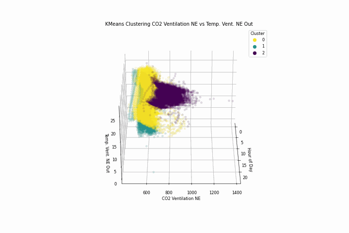

# WorkShop-USFQ
## Taller 3 de inteligencia artificial

- **Nombre del grupo**: G5
- **Integrantes del grupo**:
  * Felipe Toscano
  * José Asitimbay
  * Brayan Lechón
  * Christian Hernandez

**Participación en el taller:**
  * **Felipe Toscano**: Desarollo principal P1 
    del 
    literal A al C, apoyo en los literales D y E
  * **José Asitimbay**: Desarollo principal P1 
    literal D y E apoyo en la redaccion del readme
  * **Brayan Lechón**: Participacion en P1 
    literales A, D, E y F. Participacion en 
    estructuracion del directorio del 
    proyecto y redaccion del readme resultados P1.
  * **Christian Hernandez**: Desarollo y 
    redaccion de resultados del P2.

## GLPK package:
The GLPK (GNU Linear Programming Kit) package is intended for solving large-scale linear programming (LP), mixed integer programming (MIP), and other related problems. It is a set of routines written in ANSI C and organized in the form of a callable library.
This project uses this Linear Programming Kit to solve large-scale problems related to Logistics, the installation
depends on the Operating System:

Windows: https://winglpk.sourceforge.net/

Linux: apt-get install -y -qq glpk-utils

Mac:  brew install glpk

# 1. Uso de Aprendizaje no Supervisado

## A. Plotear las variables
Presentar un gráfico por cada variable que muestre sus valores superpuestos por cada día. Para propósito de explicación, la gráfica anterior muestra un ejemplo de una
2  variable de presencia solar que no corresponde a este set de datos, pero sirve de ilustración.
### CO2 Ventilación NE
**Grafico agrupado por dia y hora**

**Grafico agrupado por Semana del año vs Dia y Hora**

### C02 Ventilacion SW
**Grafico agrupado por dia y hora**

**Grafico agrupado por Semana del año vs Dia y Hora**

### Temperatura NE
**Grafico agrupado por dia y hora**

**Grafico agrupado por Semana del año vs Dia y Hora**

### Temperatura SW 
**Grafico agrupado por dia y hora**

**Grafico agrupado por Semana del año vs Dia y Hora**

## B. Encontrar patrones – análisis univariable
Utilizando cualquier técnica de aprendizaje no supervisado, encontrar los patrones diarios que existen en el data set, para cada variable individual. Utilizar al menos dos técnicas para verificar su consistencia entre las dos técnicas.

### CO2 Ventilación NE

### C02 Ventilacion SW

### Temperatura NE

### Temperatura SW

## C. Encontrar anomalías – análisis univariable
Es posible que ciertos perfiles diarios en el set de datos no pertenezcan a los patrones diarios descubiertos en el literal B. ¿Cómo detectarlos?
## D. Encontrar patrones – análisis multivariable
De manera similar al literal B, encontrar los patrones diarios que existen en el data set, para cada par de variables, es decir, las dos de la parte Norte Este y las dos de la parte Sur Oeste. Utilizar al menos dos técnicas para verificar su consistencia entre las dos técnicas.

### C02 Ventilacion NE vs Temperatura NE

### C02 Ventilacion SW vs Temperatura SW

## E. Encontrar anomalías – análisis multivariable
De manera similar al literal C, encontrar anomalías, pero de los dos pares de variables.

### C02 Ventilacion NE vs Temperatura NE
**Agrupacion por Hora**

**Agrupacion por Dia de la Semana**

### C02 Ventilacion SW vs Temperatura SW
**Agrupacion por Hora**

**Agrupacion por Dia de la Semana**

## F. Conclusiones
Se podrá encontrar alguna relación entre la parte Norte Este y Sur Oeste del edificio, ¿Qué pudieran sugerir los patrones y las anomalías encontradas?

## Investigacion Operativa

### Analiza el codigo propuesto

En la carpeta Taller3/P2_TSP se coloca el código del modelado del TSP usando LP, 
correr el caso 1, con una tolerancia de 0.20 y tiempo límite de 120 segundos, marcar los 
tiempos que se demora para 10, 20, 30, 40 y 50 ciudades. 
Subjetivamente, 
#### ¿qué tal te parece las soluciones que ha arrojado el modelo sin aplicar todavía una heurística que ayude al modelo? 

|    |   n_cities |   distance |   distancia_minima_nodos |   distancia_maxima_nodos |   distancia_promedio_nodos |   distancia_total_minima_posible |   distancia_total_maxima_posible |
|---:|-----------:|-----------:|-------------------------:|-------------------------:|---------------------------:|---------------------------------:|---------------------------------:|
|  0 |         10 |    570.7   |                13.8578   |                  196.88  |                    109.712 |                          216.246 |                          308.923 |
|  1 |         20 |    816.339 |                 3.80132  |                  231.421 |                    108.609 |                          373.766 |                          533.951 |
|  2 |         30 |    992.891 |                 3.00666  |                  231.762 |                    103.791 |                          541.997 |                          774.281 |
|  3 |         40 |   1230.5   |                 0.894427 |                  258.558 |                    107.687 |                          741.065 |                         1058.66  |
|  4 |         50 |   1316.64  |                 2.06155  |                  234.784 |                    114.33  |                          916.586 |                         1309.41  |

Las soluciones del modelo TSP sin heurísticas muestran un aumento lógico en la distancia total a medida que crece el número de ciudades, lo que es esperado. Para valorar la eficacia de estas 
soluciones, sería ideal compararlas contra soluciones heurísticas. Las heurísticas podrían ofrecer un buen equilibrio entre calidad de solución y eficiencia computacional.

### Analizar el parámetro tee 
 
El parámetro tee determina si los detalles de la ejecución del solver se imprimen en la consola. Con tee=True, se visualiza la salida del proceso de optimización; tee=False mantiene la operación 
en silencio, sin imprimir nada.

### Aplicar heurística de límites a la función objetivo 

