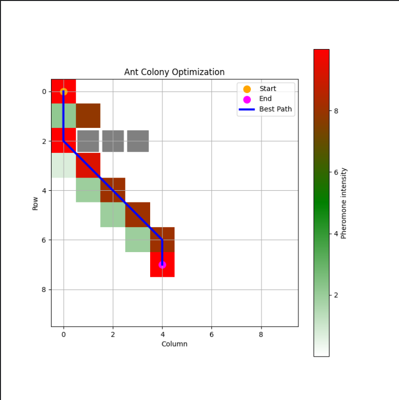

### A. Correr la implementación planteada
1) Inicialización (método init): La clase AntColonyOptimization se inicializa con puntos de inicio y fin, una lista de obstáculos, tamaño de la cuadrícula, número de hormigas, tasa de evaporación y parámetros alfa y beta. También inicializa una cuadrícula de feromonas con el mismo tamaño que la cuadrícula y establece el mejor camino en None.

2) Obtener Vecinos (método _get_neighbors): Este método toma una posición como entrada y devuelve una lista de posiciones vecinas que se encuentran dentro de la cuadrícula y no son obstáculos.

3) Seleccionar Próxima Posición (método _select_next_position): Este método toma la posición actual y una lista de posiciones visitadas como entrada. Calcula la probabilidad de moverse a cada vecino no visitado según la cantidad de feromona y la distancia heurística al punto final. Luego selecciona un vecino al que moverse en función de estas probabilidades.

4) Evaporar Feromonas (método _evaporate_pheromones): Este método reduce la cantidad de feromona en cada posición de la cuadrícula por una cierta tasa de evaporación.

5) Depositar Feromonas (método _deposit_pheromones): Este método aumenta la cantidad de feromona en cada posición de un camino dado.

6) Encontrar el Mejor Camino (método find_best_path): Este método ejecuta el algoritmo ACO durante un número dado de iteraciones. En cada iteración, cada hormiga parte de la posición de inicio y se mueve a posiciones vecinas hasta que llega a la posición final o no puede moverse más. Las hormigas prefieren moverse a posiciones con más feromona y más cerca del punto final. Después de que todas las hormigas se han movido, las feromonas se evaporan y luego se depositan más feromonas en las posiciones del camino más corto. El camino más corto también se guarda si es más corto que el mejor camino previamente guardado.

7) Graficar (método plot): Este método grafica la cuadrícula de feromonas, los puntos de inicio y fin, los obstáculos y el mejor camino encontrado.

### Gráfico del caso de estudio 1





### Gráfico del caso de estudio 2


### B. ¿Qué ocurre con el segundo caso de estudio?
La condición actual se basa en el mejor ruta, cuya condición se encuentra relacionada con su tamaño, sin embargo es necesario modificar la condición para evaluar si la última posición de la mejor ruta sea el final establecido, para que el algoritmo pueda encontrar el camino hacia la posición final.

```python
if self.best_path is None or len(best_path) <= len(self.best_path)
    and best_path[-1] == self.end:
                self.best_path = best_path
```


Pasar argumentos alpha y beta al constructor
```python
AntColonyOptimization(start, end, obstacles, alpha=5, beta=30)
```
Como parte de la experimentación se tomaron en cuenta los valores de Alpha que representa la tendencia de las hormigas a perseguir las feromonas. Mientras más alto, mayor es la influencia de las feromonas. El alpha por defecto es 0.1. Aumentamos el alpha a 5.
Beta representa la importancia que se le otorga a los resultados de la heurística. Mientras más alto, mayor es la influencia de la heurística. El beta por defecto es de 15. Ahora es 30.
Vale la pena mencionar que se los valores alpha=5 y beta=30 se determinaron empíricamente, con prueba y error, pero podrían determinarse también probando una serie de valores para alpha y beta de tal manera que se llegue al recuadro objetivo.


### C. Describir los parámetros del modelo
- start y end: Estos son pares ordenados que representan los puntos de inicio y final del camino que las hormigas intentarán encontrar. Se utilizan para inicializar las posiciones de las hormigas y determinar cuándo las hormigas han llegado al final del camino.

- obstacles: Esta es una lista de pares ordenados que representan las posiciones de los obstáculos en la cuadrícula. Las hormigas no pueden moverse a posiciones que son obstáculos.

- grid_size: Este es un par ordenado que representa el tamaño de la cuadrícula. Se utiliza para inicializar la cuadrícula de feromonas y para verificar si una posición está dentro de la cuadrícula.

- n_ants: Este es el número de hormigas que se utilizarán en el algoritmo. Más hormigas pueden explorar más caminos, pero también requieren más recursos computacionales.

- n_iterations: Este es el número de iteraciones que ejecutará el algoritmo. Más iteraciones pueden conducir a soluciones mejores, pero también requieren más recursos computacionales.

- evaporation_rate: Esta es la tasa a la que las feromonas en la cuadrícula se evaporan. Una tasa de evaporación más alta hace que las feromonas desaparezcan más rápido, lo que puede evitar que las hormigas queden atrapadas en caminos subóptimos.

- alfa: Controla la importancia de la senda de feromonas cuando las hormigas eligen a qué posición moverse a continuación.

- beta: Controla la importancia de la información heurística cuando las hormigas eligen a qué posición moverse a continuación.

- Q: Esta es una constante utilizada en el cálculo de la cantidad de feromona que las hormigas depositan en la cuadrícula.

- plot: Este es un booleano que indica si graficar la cuadrícula y el mejor camino encontrado después de cada iteración.
### D. Pregunta de investigación
Sí. ACO está especialmente orientado a resolver problemas con espacios de solución grandes como lo es el TSP en su versión de fuerza bruta.

En el contexto del TSP, el objetivo es encontrar el camino más corto que visite cada ciudad exactamente una vez y regrese al punto de partida. Las hormigas en el ACO representarían posibles soluciones al problema. A continuación, te proporciono una descripción general de cómo se aplicaría el ACO al TSP:

Feromonas:

Cada arista del grafo (que conecta dos ciudades) tiene asociada una cantidad de feromona.
Inicialmente, las feromonas en todas las aristas pueden establecerse en un valor uniforme.
Hormigas:

Cada hormiga comienza su recorrido desde una ciudad aleatoria.
En cada paso, la hormiga decide a qué ciudad moverse basándose en la cantidad de feromona en las aristas y en la distancia a la ciudad vecina.
Depósito y evaporación de feromonas:

Después de que todas las hormigas hayan completado su recorrido, se deposita feromona adicional en las aristas del camino más corto.
Las feromonas en todas las aristas experimentan evaporación para simular la disminución natural con el tiempo.
Iteración:

Repetir el proceso de movimientos de hormigas, depósito y evaporación de feromonas durante un número específico de iteraciones.
Convergencia:

El algoritmo converge hacia una solución óptima a medida que las feromonas se acumulan en el camino más corto.
El ACO aprovecha la capacidad de las hormigas para encontrar soluciones aproximadas al TSP y utiliza la retroalimentación positiva (depósito de feromonas en caminos cortos) y negativa (evaporación) para converger hacia soluciones óptimas en iteraciones sucesivas. Es importante ajustar los parámetros del algoritmo, como la tasa de evaporación y los parámetros de importancia relativa de la feromona y la distancia, para obtener mejores resultados en problemas específicos del TSP.