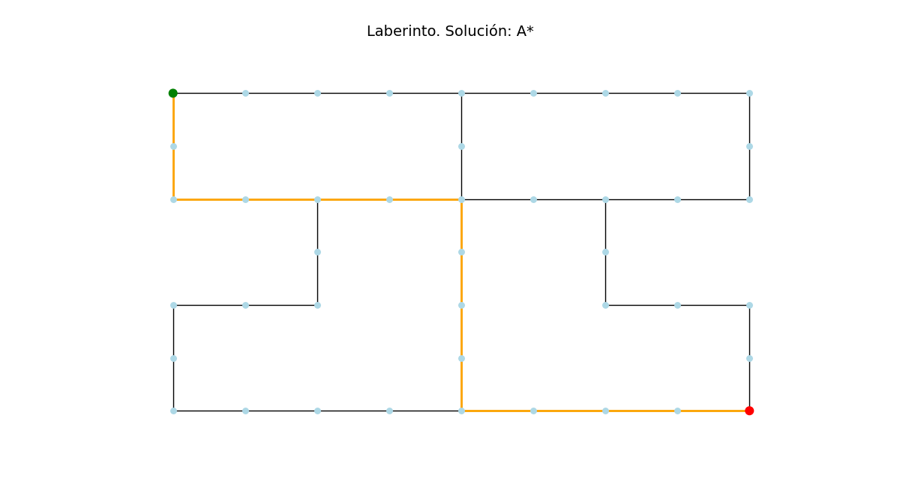
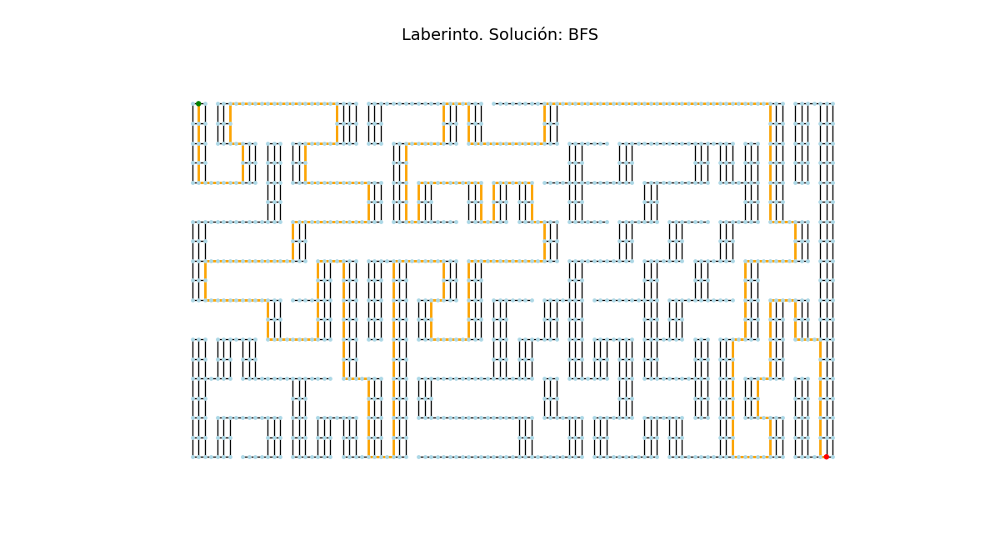
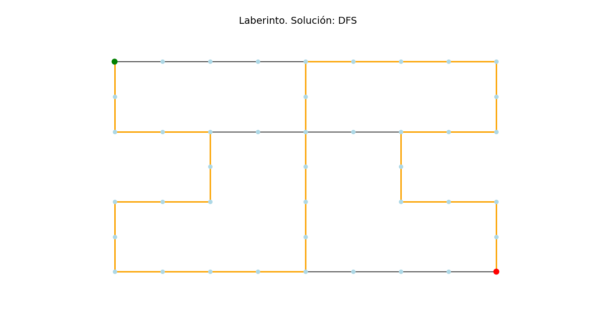
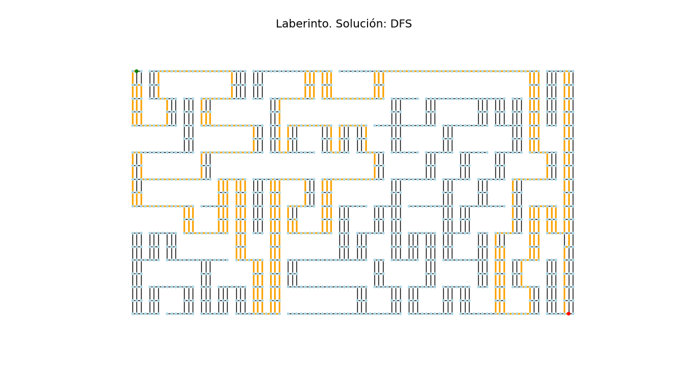

# Search Algorithms Results

This document presents the results of running different search algorithms on a given problem space. Each algorithm's performance is evaluated based on the number of nodes in the solution and the execution time. The solution path that each algorithm found is also shown graphically.

## A* Algorithm
- Number of nodes in the solution: 345
- Execution time: 0.007611989974975586 seconds

### Solution Paths

## BFS Algorithm
- Number of nodes in the solution: 345
- Execution time: 0.005369901657104492 seconds

### Solution Paths

## DFS Algorithm
- Number of nodes in the solution: 511
- Execution time: 0.003754854202270508 seconds

### Solution Paths

## GBFS Algorithm
- Number of nodes in the solution: 345
- Execution time: 0.00633692741394043 seconds

### Solution Paths

