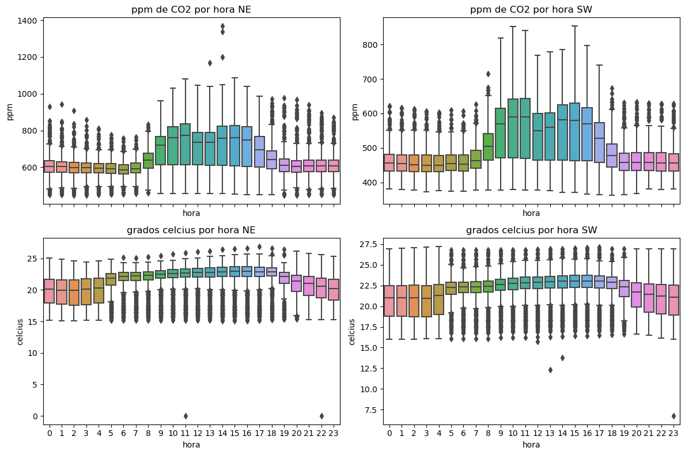
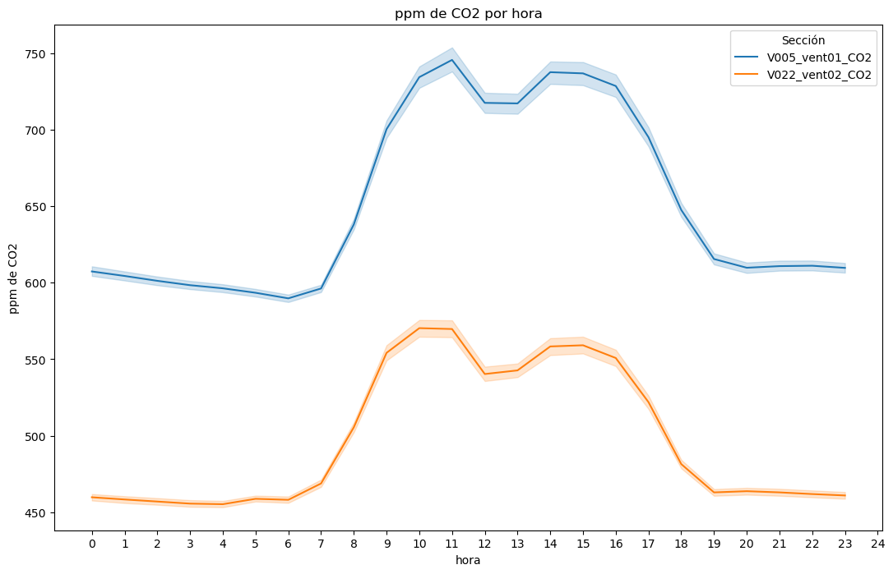
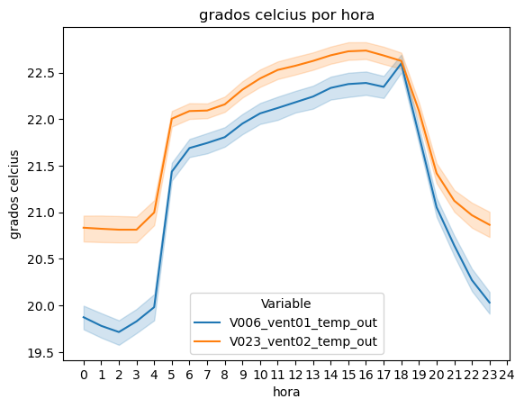

# WorkShop1-USFQ
## Taller 3 de inteligencia artificial
## EJERCICIO 1

Para este ejercicio se generaron agrupaciones con KMEANS, y AGLOMERATIVO JERARQUICO, en las cuales OBTUVIMOS LO SIGUIENTE:

# Resultados

### A. Plotear las variables
#### Grafico de los patrones diarios de cada varianble.

#### Grafico de la insicencia por hora de la variable CO2(Se observa en las areas mas sombreadas que la vairbale CO2 tiene mayor incidencia, esto desde las 10h00 hasta las 17h00).

#### Grafico de la insicencia por hora de la variable Temperatura (Se observa el aumento de temperatura desde las 4H00, esto se relaciona con el aumento de CO2 de la grafica anterior, se identtifica que esto es causado en un horario laboral).

Las dos variables se observa que estan relacionadas, si aumenta CO2, aumenta la temperatura del edificio de manera general

### B. Encontrar patrones – análisis univariable

Para obtener un analisis univariable, lo que se realizo primero fue una reducción de dimensionalida de los patrones mediante PCA, ya que cada uno tiene 24 componentes. Como resultado de esa reduccion se tuvo la siguiente gráfica con 2 componentes por patrón:

Posteriormente se realizó la clusterizacion mediante los dos metodos propuestos.
### KMEANS

Se observa que KMEANS clusteriza los patrones de CO2 en dos grupos, el primero corresponde a los dias entre semana o dias laborables (Lunes a Viernes), mientras que en el otro grupo se encuentran los fines de semana (Sabado y Domingo)

# CONCLUSIONES
Para comparar el comportamiento, efectividad y rapidez establecimos las siguientes métricas para evaluar los algoritmos:
- Nodos de la ruta (distancia de la ruta).
- Nodos visitados (distancia de las visitas).
- Tiempo de ejecución de las búsquedas.

Se manejan laberintos de diferente profundidad, el más pequeño cuenta con 43 nodos , el mediano cuenta con 201 nodos y el más grande cuenta con 1270 nodos. 

- Todos los algoritmos encontraron la misma ruta, a excepción del laberinto 1, donde la busqueda bidireccional generó una ruta con una baldosa adicional, ya que el punto de encuentro no se localizó en la ruta de los otros algoritmos, la cual es la más corta.

- En tiempos de ejecucion, de manera general la busqueda bidireccional es el algoritmo más rapido, inclusive en casos donde este no encontró la ruta más corta como en el laberinto 1. Igualmente fue el más rapido en el laberinto 3, a pesar de que fue el que visitó más nodos (1104 nodos visitados)

- Con respecto a los nodos visitados (procesamiento de la ruta), el algoritmo BFS es el que consume más recursos, a excepción del laberinto 3 comentado en el punto anterior.

 