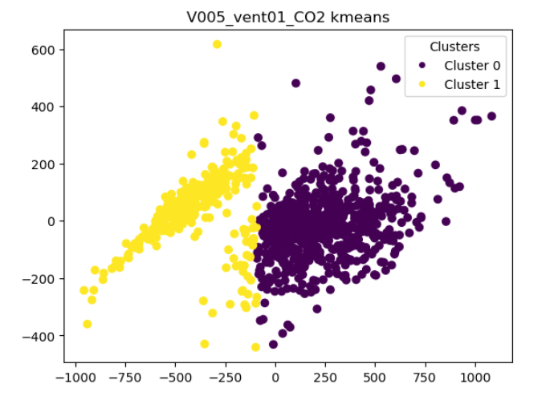
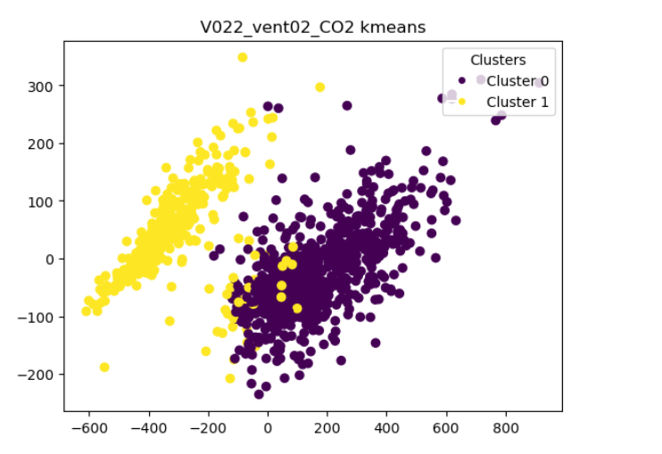
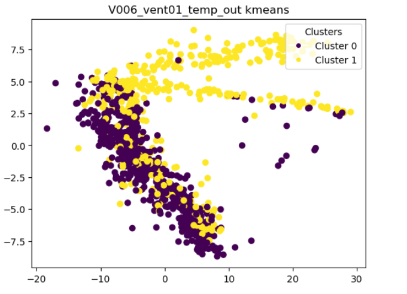
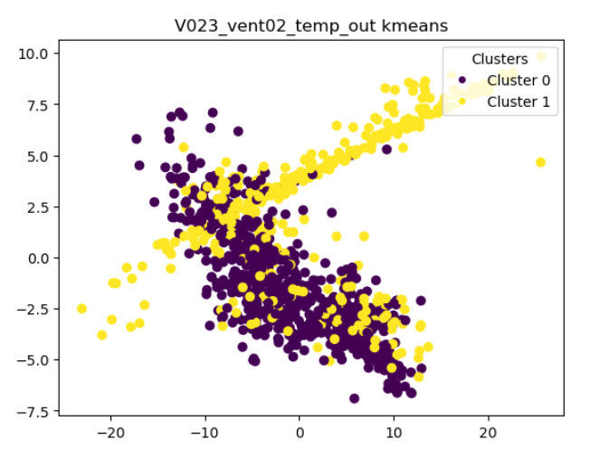
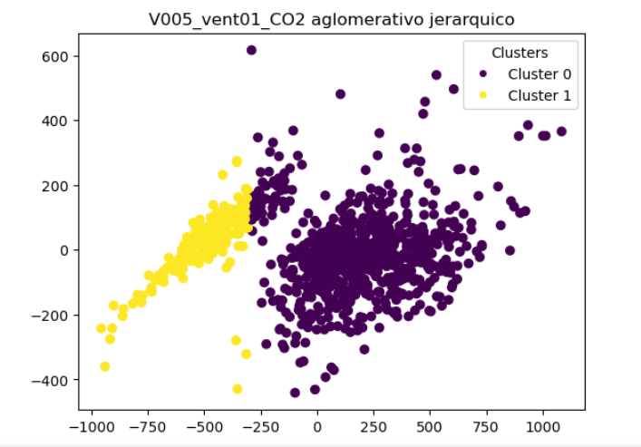
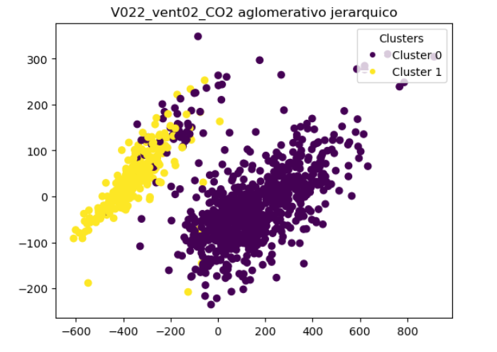
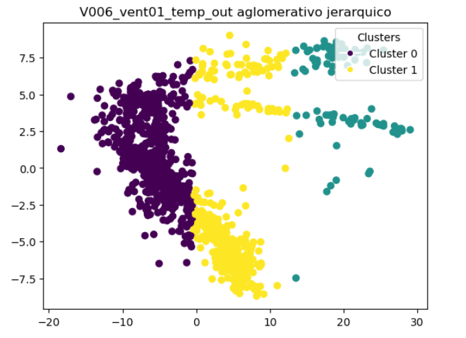
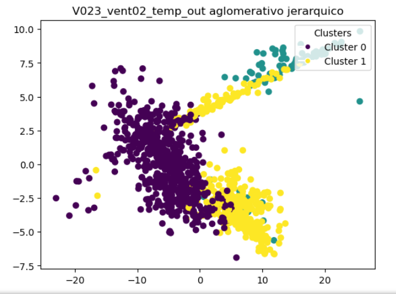

# WorkShop1-USFQ
## Taller 3 de inteligencia artificial
## EJERCICIO 1

Para este ejercicio se generaron agrupaciones con KMEANS, y AGLOMERATIVO JERARQUICO, en las cuales OBTUVIMOS LO SIGUIENTE:

# Resultados

### A. Plotear las variables
#### Grafico de los patrones diarios de cada varianble.

#### Grafico de la insicencia por hora de la variable CO2(Se observa en las areas mas sombreadas que la vairbale CO2 tiene mayor incidencia, esto desde las 10h00 hasta las 17h00).

#### Grafico de la insicencia por hora de la variable Temperatura (Se observa el aumento de temperatura desde las 4H00, esto se relaciona con el aumento de CO2 de la grafica anterior, se identtifica que esto es causado en un horario laboral).

Las dos variables se observa que estan relacionadas, si aumenta CO2, aumenta la temperatura del edificio de manera general

### B. Encontrar patrones – análisis univariable

Para obtener un analisis univariable, lo que se realizo primero fue una reducción de dimensionalida de los patrones mediante PCA, ya que cada uno tiene 24 componentes. Como resultado de esa reduccion se tuvo la siguiente gráfica con 2 componentes por patrón:

Posteriormente se realizó la clusterizacion mediante los dos metodos propuestos.
### KMEANS

Se observa que KMEANS clusteriza los patrones de CO2 en dos grupos, el cluster 0 corresponde a los dias entre semana o dias laborables (Lunes a Viernes), mientras que el cluste 1 representa los fines de semana (Sabado y Domingo)

Se observa que KMEANS no clusteriza los patrones de temperatura de una manera adecuada, ya que ambos clusters estan casi sobrepuestos, el cluster 0 corresponde a los dias entre semana o dias laborables (Lunes a Viernes), mientras que el cluste 1 representa los fines de semana (Sabado y Domingo)

### AGLOMERATIVO JERARQUICO

Se observa que AGLOMERATIVO JERARQUICO clusteriza los patrones de CO2 en dos grupos, el cluster 0 corresponde a los dias entre semana o dias laborables (Lunes a Viernes), mientras que el cluste 1 representa los fines de semana (Sabado y Domingo)

Se observa que el AGLOMERATIVO JERARQUICO clusteriza los patrones de Temperatura en tres grupos, el cluster 0 corresponde a los dias entre semana o dias laborables (Lunes a Viernes), mientras que el cluste 1 representa los fines de semana (Sabado y Domingo)

# CONCLUSIONES
- En términos generales el método de aglomeración jerárquica realizo una mejor clusterizacion de todos los casos.