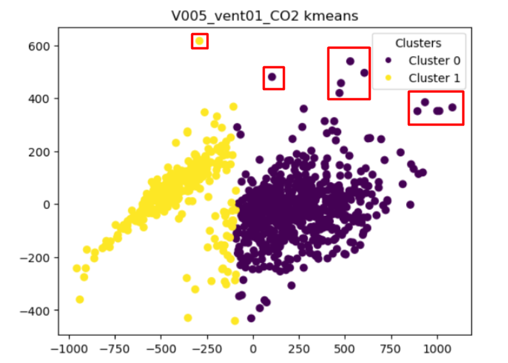
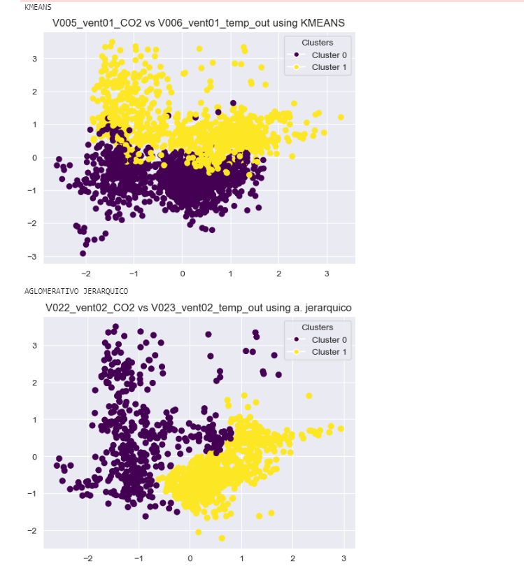

# WorkShop1-USFQ
## Taller 3 de inteligencia artificial
## EJERCICIO 1

Para este ejercicio se generaron agrupaciones con KMEANS, y AGLOMERATIVO JERARQUICO, en las cuales OBTUVIMOS LO SIGUIENTE:

# Resultados

### A. Plotear las variables
#### Grafico de los patrones diarios de cada varianble.

#### Grafico de la insicencia por hora de la variable CO2(Se observa en las areas mas sombreadas que la vairbale CO2 tiene mayor incidencia, esto desde las 10h00 hasta las 17h00).

#### Grafico de la insicencia por hora de la variable Temperatura (Se observa el aumento de temperatura desde las 4H00, esto se relaciona con el aumento de CO2 de la grafica anterior, se identtifica que esto es causado en un horario laboral).

Las dos variables se observa que estan relacionadas, si aumenta CO2, aumenta la temperatura del edificio de manera general

### B. Encontrar patrones – análisis univariable

Para obtener un analisis univariable, lo que se realizo primero fue una reducción de dimensionalida de los patrones mediante PCA, ya que cada uno tiene 24 componentes. Como resultado de esa reduccion se tuvo la siguiente gráfica con 2 componentes por patrón:

Posteriormente se realizó la clusterizacion mediante los dos metodos propuestos.
### KMEANS

Se observa que KMEANS clusteriza los patrones de CO2 en dos grupos, el cluster 0 corresponde a los dias entre semana o dias laborables (Lunes a Viernes), mientras que el cluste 1 representa los fines de semana (Sabado y Domingo)

Se observa que KMEANS no clusteriza los patrones de temperatura de una manera adecuada, ya que ambos clusters estan casi sobrepuestos, el cluster 0 corresponde a los dias entre semana o dias laborables (Lunes a Viernes), mientras que el cluste 1 representa los fines de semana (Sabado y Domingo)

### AGLOMERATIVO JERARQUICO

Se observa que AGLOMERATIVO JERARQUICO clusteriza los patrones de CO2 en dos grupos, el cluster 0 corresponde a los dias entre semana o dias laborables (Lunes a Viernes), mientras que el cluste 1 representa los fines de semana (Sabado y Domingo)

Se observa que el AGLOMERATIVO JERARQUICO clusteriza los patrones de Temperatura en tres grupos, el cluster 0 corresponde a los dias entre semana o dias laborables (Lunes a Viernes), mientras que el cluste 1 representa los fines de semana (Sabado y Domingo). El cluster 2 (verde), son valores que representan a patrones de todos los dias de la semana, pero de fehcas en la estacion Verano.

### C. Encontrar anomalías – análisis univariable
Se encuentran algunas anomalias analizando las graficas:

Se puede identicar varios valores atípicos tanto para KMEANS como para AGLOMERATIVO JERARQUICO. Estos valores coinciden con dias feriados en los que no hubo la misma cantidad de persoans en el edificio, igualmente hay valores atípicos de fines de semana en los que se agrupan en el cluster de dias laborables.

### D. Encontrar patrones – análisis multivariable
Aqui se realizoó analisis multivariable.
para todos lo casos se realizo primero reducción de componenetes tanto de la variable CO2 como de la variable temperatura, cada una a 1 componente, esto con el próposito de que los algortimos de clusterizacion represnetes los patrones en dos ejes.
Para la zona Norte Este del edificio se tiene las siguientes gráficas:

Se observa que AGLOMERATIVO JERARQUICO y KMEANS clusteriza los patrones de CO2 con Temperatura en dos grupos, el cluster 0 corresponde a los dias entre semana o dias laborables (Lunes a Viernes), mientras que el cluste 1 representa los fines de semana (Sabado y Domingo)

Para la zona Sur Oeste del edificio se tiene las siguientes gráficas:

Se observa que AGLOMERATIVO JERARQUICO y KMEANS clusteriza los patrones de CO2 con Temperatura en dos grupos, el cluster 0 corresponde a los dias entre semana o dias laborables (Lunes a Viernes), mientras que el cluste 1 representa los fines de semana (Sabado y Domingo)

### E. Encontrar anomalías – análisis multivariable

Se puede identicar varios valores atípicos tanto para KMEANS como para AGLOMERATIVO JERARQUICO. Estos valores coinciden con dias feriados en los que no hubo la misma cantidad de personas en el edificio, igualmente hay valores atípicos de fines de semana en los que se agrupan en el cluster de dias laborables.
# CONCLUSIONES
A lo largo de este análisis, hemos aplicado métodos de clustering para identificar patrones y anomalías en datos de CO2 y temperatura dentro de un edificio. Los métodos empleados incluyeron K-Means y Clustering Aglomerativo Jerárquico, y cada uno proporcionó insights valiosos en diferentes contextos.

Los gráficos de incidencia horaria revelaron que los niveles de CO2 alcanzan su pico durante el horario laboral, lo cual se correlaciona con un aumento en la temperatura. Esta observación destaca un patrón claro y esperado de actividad humana dentro del edificio. Por otro lado, la temperatura mostró un aumento natural desde las primeras horas de la mañana, sugiriendo una relación directa con el ciclo diario de calentamiento y enfriamiento.

Al reducir la dimensionalidad de los datos mediante PCA antes del clustering, pudimos visualizar los patrones diarios de manera más efectiva. El Clustering K-Means identificó consistentemente dos grupos principales: días laborables y fines de semana. Sin embargo, este método no fue tan eficaz para discriminar patrones de temperatura, ya que los clusters estaban casi superpuestos.

En contraste, el Clustering Aglomerativo Jerárquico no solo separó efectivamente los días laborables de los fines de semana, sino que también distinguió patrones de temperatura en tres grupos distintos. Este método incluso aisló patrones correspondientes a días feriados y a días atípicos donde la actividad del edificio se desviaba de lo normal.

A partir de estos análisis, se destacan varios puntos:

El Clustering Aglomerativo Jerárquico demostró ser superior en la identificación de patrones complejos y sutilezas dentro de los datos.
Los patrones de CO2 y temperatura están significativamente influenciados por las actividades humanas regulares, así como por eventos atípicos como los días feriados.
Los datos multivariables, que combinan CO2 y temperatura, permiten una mejor diferenciación entre días laborables y fines de semana en comparación con el análisis univariable.
