### A
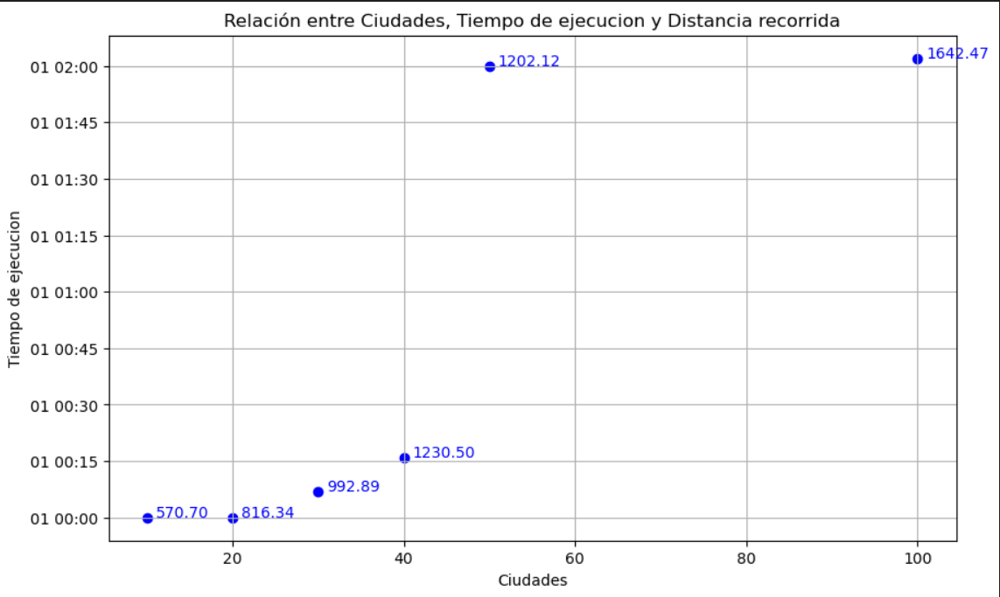
Las distancias y los tiempos de ejecución reportados tienen sentido para una solución sin heurísticas. Valores de tiempo de ejecución y distancia relativamente elevados.

### B
El argumento tee funciona como un clásico `verbose` o `debug` en otros contextos: Para mostrar/ocultar información relacionada a la ejecución del programa: datos del modelo evaluado, datos de las restricciones y datos de la ejecución en sí como restricción considerada, resultados y recursos computacionales utilizados. 

tee=True: Activa la visualización en pantalla de la salida del solucionador. Esto es útil para monitorear el progreso del solucionador, especialmente para problemas grandes o complejos donde el proceso de solución puede tardar un tiempo considerable. La salida puede incluir información sobre la iteración actual del solucionador, el estado de la solución (por ejemplo, si aún está buscando, si encontró una solución factible, si la solución es óptima), valores de la función objetivo durante la búsqueda, y cualquier mensaje de error o advertencia.

tee=False: Desactiva la visualización en pantalla de la salida del solucionador. Esta es la opción predeterminada y se utiliza cuando no necesitas ver los detalles del proceso de solución.

### C
1. Con la heurística se incluyen dos restricciones adicionales que colocan a la función objetivo dentro de un rango que acorde a los cálculos no se puede cumplir por lo que con este método no se encuentra una solución. 

<!-- 2. No sirve para todo porque el código de las heurísticas contiene fórmulas con constantes empíricas ajustadas  -->
2. No sirve para todos los casos porque porque el código de las heurísticas contiene fórmulas con constantes empíricas ajustadas, como, por ejemplo, la distancia máxima tolerable hacia un vecino. En algunos casos, esta distancia predefinida provocará que algunas rutas no sean elegibles y el algoritmo podría bloquearse y no encontrar una ruta hacia el objetivo.

### D
1. Los modelos se ejecutan en el mismo periodo de tiempo, pero al aplicar la heurística del vecino más cercano, la distancia total recorrida es menor comparada al modelo sin ninguna heurística dado que la heurística incluye una restricción que restringe el hecho de viajar largas distancias entre ciudades.

2. Esta heurística, dado que está creada de manera general, sin variables o constantes preestablecidas (como en la heurística 'limitar_funcion_objetivo'), los valores manejados se autorregulan (por ejemplo, calcular el promedio de las distancias de los vecinos), por lo que se podría utilizar en cualquier caso.

### E
La inclusión de restricciones adicionales, creadas de la manera apropiada, que no anule la región factible de respuesta, permite depurar y mejorar las soluciones esperadas logrando mejores resultados. Se requiere adecuar estas restricciones cuidando su correcta aplicación a los modelos.

### Opcional
Para mejorar la ruta alcanzada y encontrar caminos más cortos, se implementó la siguiente función por dos ocasiones consecutivas, lo que considerando hasta 100 ciudades fue suficiente para reducir los caminos y eliminar todos los cruces.

``` 
    def dos_opt(self, ruta):
        """Implementación del algoritmo 2-opt para mejorar una ruta del TSP."""
        mejora = True
        while mejora:
            mejora = False
            for i in range(1, len(ruta) - 2):
                for j in range(i + 1, len(ruta)):
                    if j - i == 1: continue  # No se intercambia con aristas adyacentes
                    nueva_ruta = ruta[:i] + ruta[i:j][::-1] + ruta[j:]
                    distancia_nueva_ruta = calculate_path_distance(self.distancias, nueva_ruta)
                    distancia_ruta =calculate_path_distance(self.distancias, ruta)
                    if distancia_nueva_ruta < calculate_path_distance(self.distancias, ruta):
                        ruta = nueva_ruta
                        mejora = True
            break  # Si no hay mejora, termina el loop
        return ruta, min(distancia_nueva_ruta, distancia_ruta)
``` 

Esta función realiza una reasignación de aristas en la ruta previamente alcanzada con el objetivo de minimizar las distancias lo que elimina los cruces totalmente con dos iteraciones y minimiza las distancias:

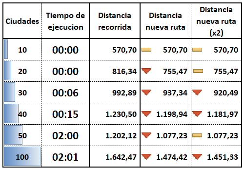

#### Rutas optimizadas:

<div>
    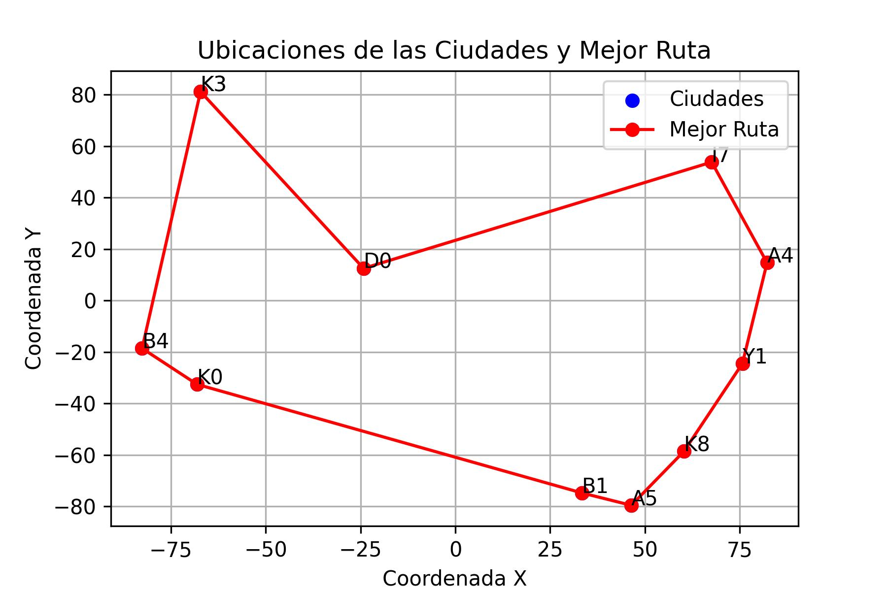
    
</div>
<div>
    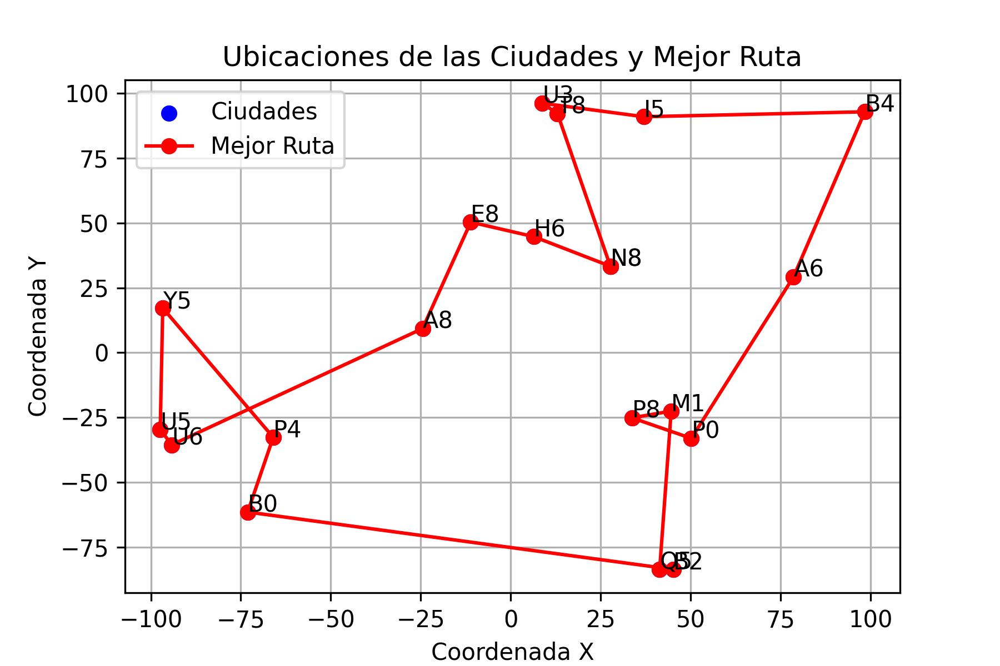
    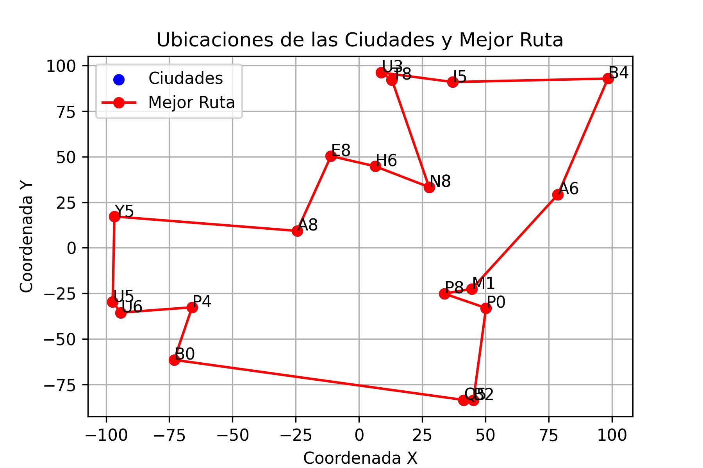
</div>
<div>
    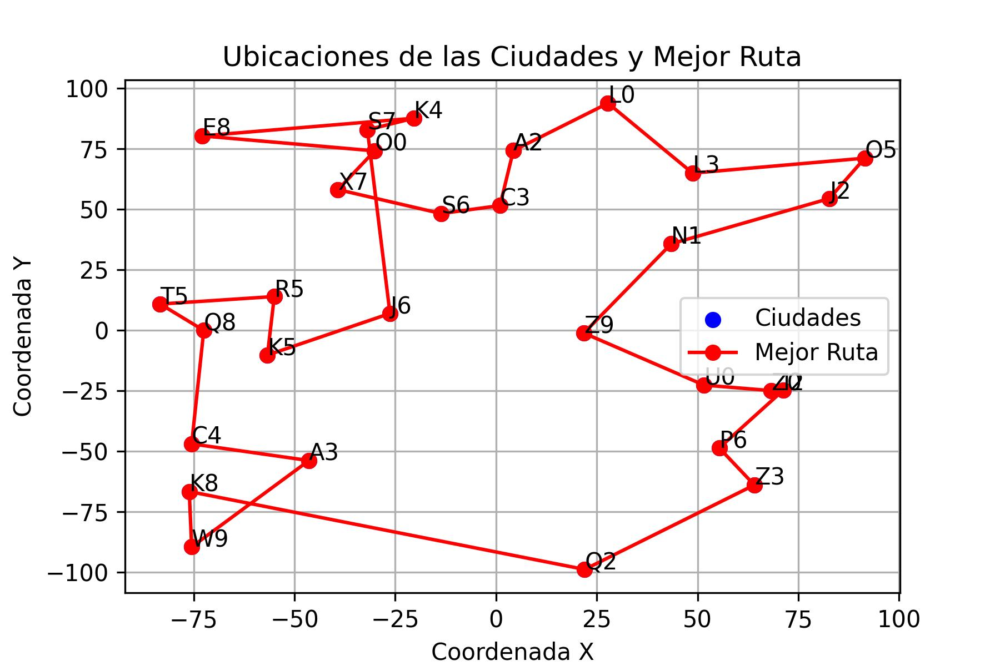
    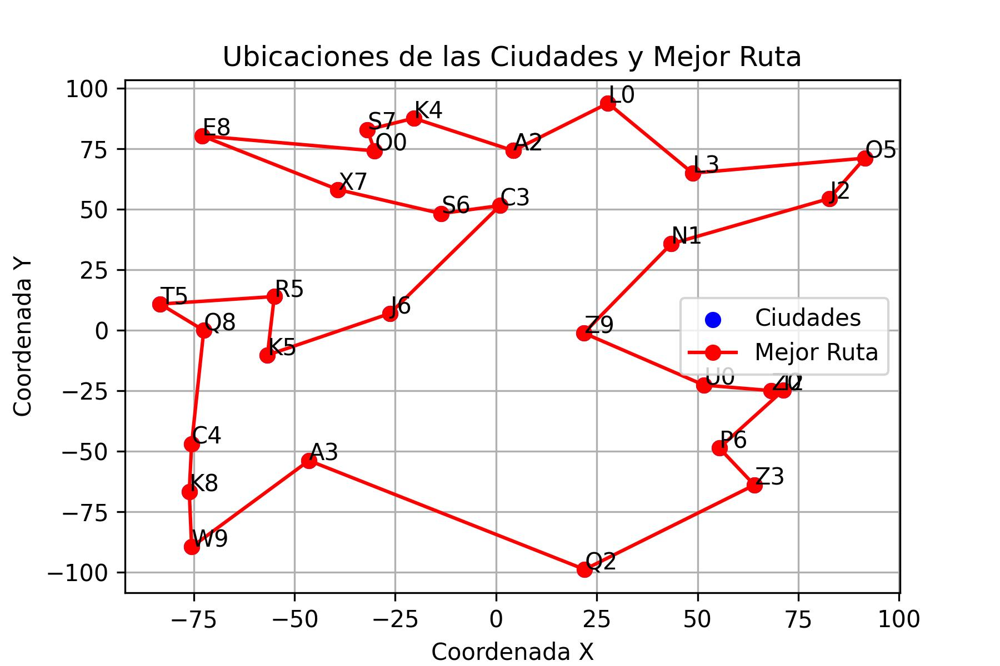
</div>
<div>
    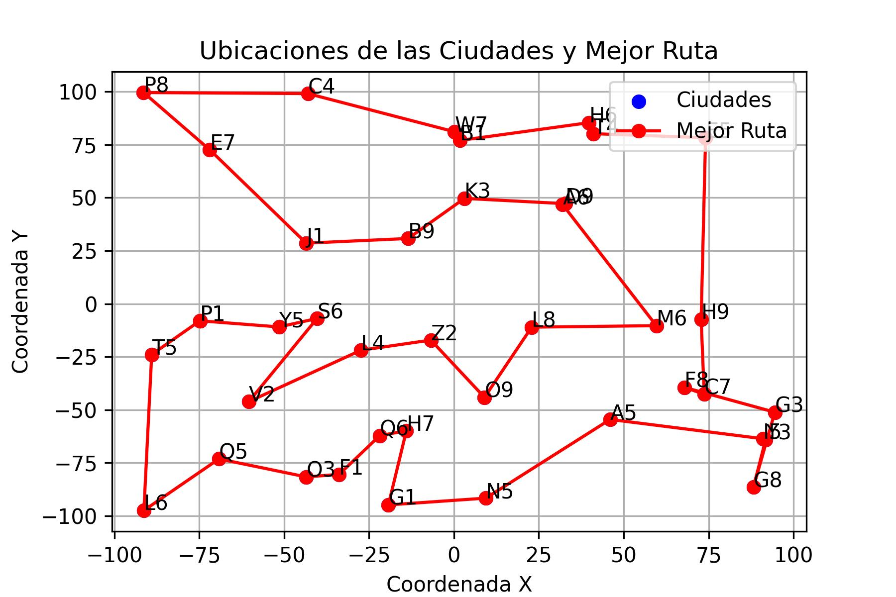
    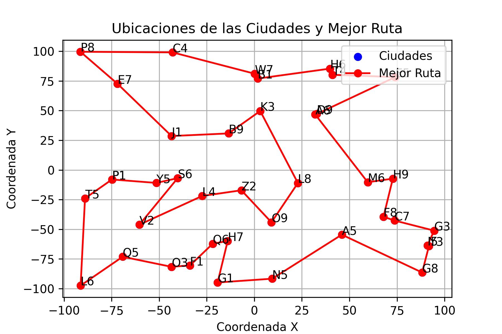
</div>
<div>
    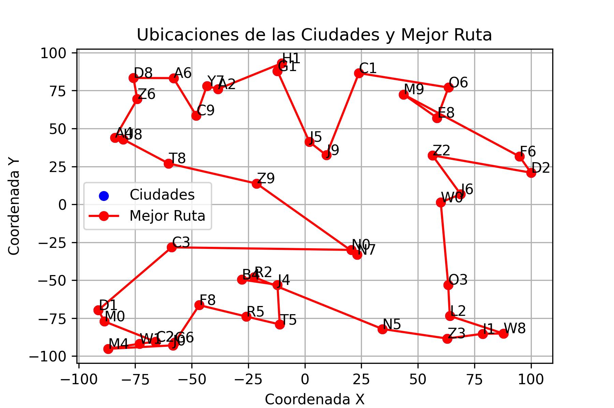
    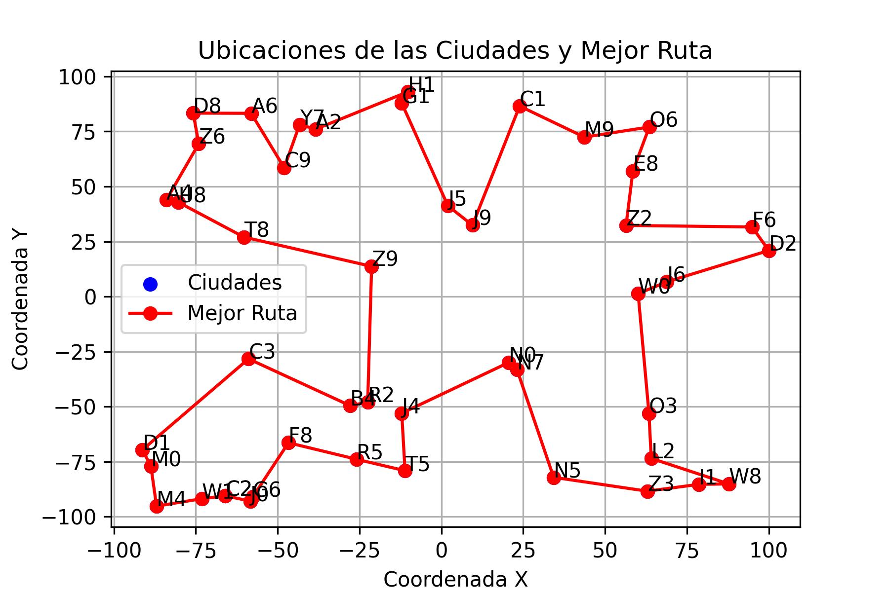
</div>
<div>
    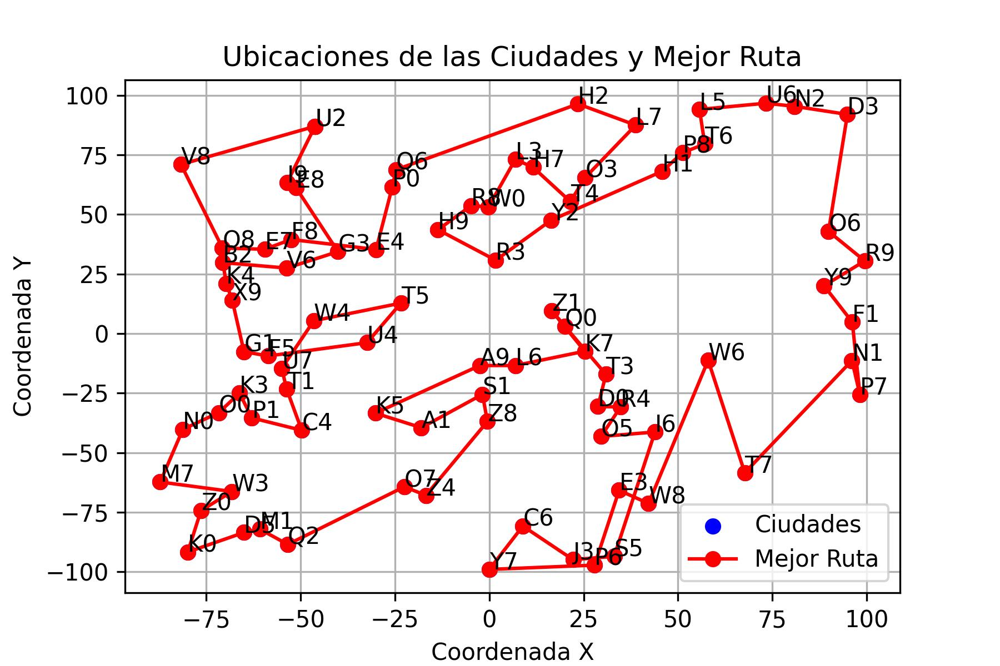
    
</div>


