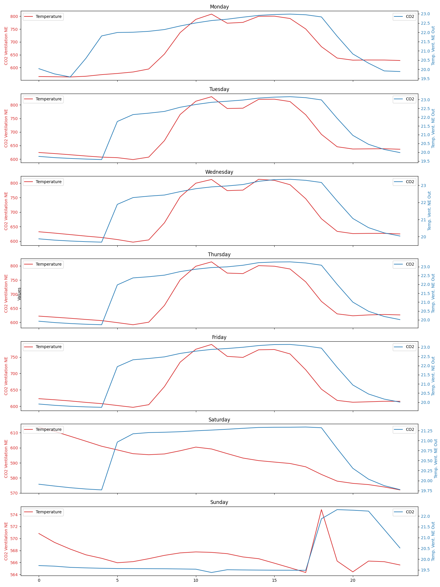
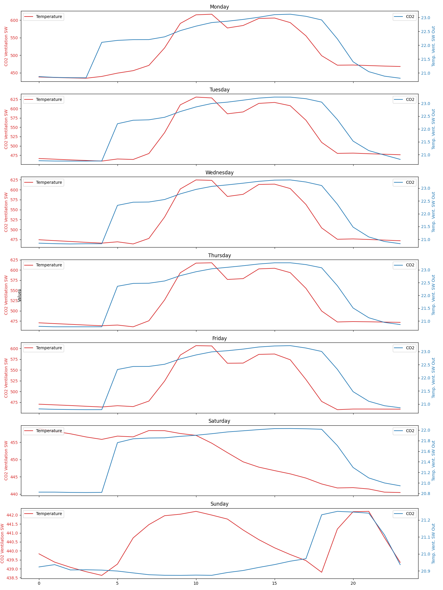

# WorkShop-USFQ
## Taller 3 de inteligencia artificial

- **Nombre del grupo**: G5
- **Integrantes del grupo**:
  * Felipe Toscano
  * José Asitimbay
  * Brayan Lechón
  * Christian Hernandez

**Participación en el taller:**
  * **Felipe Toscano**: Desarollo y redacción 
    de las conclusiones ejercicio P1 del 
    literal A al C, 
    apoyo en los literales D y E
  * **José Asitimbay**: Desarollo y redacción 
    de las conclusiones ejercicio P1 
    literal D y E
  * **Brayan Lechón**: Apoyo en P1 
    literales A, D, E y F. Estructuración del 
    directorio del proyecto y redacción del 
    readme resultados P1.
  * **Christian Hernandez**: Desarollo y 
    redacción de resultados del ejercicio P2.

## GLPK package:
The GLPK (GNU Linear Programming Kit) package is intended for solving large-scale linear programming (LP), mixed integer programming (MIP), and other related problems. It is a set of routines written in ANSI C and organized in the form of a callable library.
This project uses this Linear Programming Kit to solve large-scale problems related to Logistics, the installation
depends on the Operating System:

Windows: https://winglpk.sourceforge.net/

Linux: apt-get install -y -qq glpk-utils

Mac:  brew install glpk

# 1. Uso de Aprendizaje no Supervisado

## A. Plotear las variables
Presentar un gráfico por cada variable que muestre sus valores superpuestos por cada día. Para propósito de explicación, la gráfica anterior muestra un ejemplo de una
2  variable de presencia solar que no corresponde a este set de datos, pero sirve de ilustración.
### CO2 Ventilación NE
**Grafico agrupado por dia y hora**

**Grafico agrupado por Semana del año vs Dia y Hora**

### C02 Ventilacion SW
**Grafico agrupado por dia y hora**

**Grafico agrupado por Semana del año vs Dia y Hora**

### Temperatura NE
**Grafico agrupado por dia y hora**

**Grafico agrupado por Semana del año vs Dia y Hora**

### Temperatura SW 
**Grafico agrupado por dia y hora**

**Grafico agrupado por Semana del año vs Dia y Hora**

## B. Encontrar patrones – análisis univariable
Utilizando cualquier técnica de aprendizaje no supervisado, encontrar los patrones diarios que existen en el data set, para cada variable individual. Utilizar al menos dos técnicas para verificar su consistencia entre las dos técnicas.

### CO2 Ventilación NE

### C02 Ventilacion SW

### Temperatura NE

### Temperatura SW

## C. Encontrar anomalías – análisis univariable

Al observar las temperaturas y ventilación de CO2 en el heat map de las 52 semanas del año podemos observar la correlación entre la temperatura y la cantidad de CO2 cada una con el horario laboral del edificio. Al iniciar la jornada laboral  vemos el incremento de temperatura y de CO2, lo mismo ocurre al hacer el análisis por días laborables.
Al realizar los clusterizados y graficarlos en un nuevo heatmap vemos 3 clusters que vendrían a ser los niveles o intensidad del CO2 y de la temperatura respectivamente, ¿qué datos atípicos podríamos ver y como identificarlos? Estos  vendrían a ser los comportamientos tanto de la temperatura como de CO2 en épocas de invierno (Enero-Marzo) y también de los fines de semana.  Por ejemplo un cluster vendría con datos atípicos de ventilación de CO2  ya que solo aparece en los días laborables y en las primeras y últimas semanas del año, esto respondería a una recircularización del CO2 por temas del invierno. En cambio en la temperatura vemos 3 cluster y el clúster que indica una temperatura mayor vemos un comportamiento anormal los domingos de invierno y es debido a posiblemente un precalentamiento previo para el lunes que es laboral.
Los clusterizados nos permitieron identificar estos comportamientos anormales al relacionarlos con las semanas del año.

## D. Encontrar patrones – análisis multivariable
De manera similar al literal B, encontrar los patrones diarios que existen en el data set, para cada par de variables, es decir, las dos de la parte Norte Este y las dos de la parte Sur Oeste. Utilizar al menos dos técnicas para verificar su consistencia entre las dos técnicas.

### C02 Ventilacion NE vs Temperatura NE

### C02 Ventilacion SW vs Temperatura SW

## E. Encontrar anomalías – análisis multivariable
De manera similar al literal C, encontrar anomalías, pero de los dos pares de variables.

### C02 Ventilacion NE vs Temperatura NE
**Agrupacion por Hora**

**Agrupacion por Dia de la Semana**

### C02 Ventilacion SW vs Temperatura SW
**Agrupacion por Hora**

**Agrupacion por Dia de la Semana**

## F. Conclusiones

El análisis univariable muestra patrones en relación con los niveles de CO2 y la temperatura dentro del dataset, utilizando un gráfico de calor y una técnica de clusterización se identificó lo siguiente:

1. Tendencias identificadas a través del gráfico de calor:
- Los niveles de CO2 son significativamente más altos durante las horas de 6 a 18 de lunes a viernes, con picos en los primeros y últimos meses del año. Este patrón se relaciona a una mayor recirculación del aire en el edificio para minimizar las pérdidas de calor.
- Se observan niveles bajos de CO2 durante la primera y última semana del año, lo cual podría indicar una menor presencia de personal en el edificio debido a las festividades y, por consiguiente, una reducción en la actividad.
- La temperatura dentro del edificio comienza a incrementarse desde las 4 de la mañana todos los días, excepto los domingos, cuando el aumento empieza a partir de las 5 de la tarde. Este fenómeno se relaciona con sistemas de precalentamiento diseñados para asegurar una temperatura confortable al momento de la llegada del personal. Este patrón se mantiene consistente a lo largo del año.
- Se registra un incremento general en la temperatura del edificio desde la semana 14 hasta la semana 48, alcanzando su punto más alto entre las semanas 28 y 36. Este aumento corresponde a las temporadas de primavera, verano y el inicio del otoño.

2. Clusterización usando Kmean (k=3 obtenido 
   mediante el método del codo):
- La aplicación de la clusterización con k igual a 3 ha permitido distinguir entre patrones usuales y menos comunes, como por ejemplo, niveles anormalmente altos de temperatura o CO2. Esta técnica ha facilitado la identificación de comportamientos típicos y atípicos dentro del dataset, proporcionando una comprensión más profunda de las dinámicas ambientales en el edificio.

Estos hallazgos son fundamentales para entender cómo fluctúan los niveles de CO2 y la temperatura en el edificio a lo largo del día y del año, y podrían indicar la implementación de medidas que mejoran la eficiencia energética y el bienestar de los ocupantes.

En el análisis multivariable, se examinaron conjuntamente la temperatura y la ventilación de CO2 para descubrir patrones que emergen de su interacción. Se aplicó la técnica de Análisis de Componentes Principales (PCA) para reducir la dimensionalidad de los datos, manteniendo al mismo tiempo la integridad de la información crucial. A través del proceso de clustering, se identificaron tres grupos distintos caracterizados por:
1.	Alta Temperatura y Alto CO2: Este cluster es prominente durante las horas y días laborables, lo cual es coherente con la mayor presencia de personas en el edificio, resultando en un aumento simultáneo de la temperatura y los niveles de CO2.
2.	Baja Temperatura y Bajo CO2: Este grupo es más frecuente en las primeras horas de la mañana y últimas de la noche, momentos en los cuales el edificio se encuentra generalmente vacío, reflejando los niveles más bajos de actividad y presencia humana.
3.	Alta Temperatura y Bajo CO2: Este cluster sugiere una fase de transición en la cual el edificio comienza a experimentar un aumento de temperatura antes de que se refleje un incremento proporcional en los niveles de CO2. Esto puede ocurrir en los momentos previos a la llegada de las personas al edificio, posiblemente en días más fríos donde los sistemas de calefacción se activan temprano para asegurar el confort al inicio de la jornada laboral, o en situaciones donde la ventilación es eficaz en la disipación del CO2 a pesar de una temperatura ascendente.

En conclusión, el enfoque de clustering multivariable para analizar conjuntamente la temperatura y la ventilación de CO2 ha demostrado ser fundamental para comprender la interacción compleja entre estos factores ambientales. Este método supera las limitaciones de los análisis univariantes, que podrían pasar por alto patrones clave resultantes de la interrelación entre variables. Al explorar las variables de manera combinada, hemos podido identificar grupos distintos que reflejan las dinámicas operacionales y la ocupación del edificio, que de otro modo podrían haber permanecido ocultos.
Estos insights no solo destacan el comportamiento ambiental del edificio sino que también subrayan oportunidades para optimizar los sistemas de calefacción, ventilación y aire acondicionado.

## Investigacion Operativa

### Analiza el codigo propuesto

En la carpeta Taller3/P2_TSP se coloca el código del modelado del TSP usando LP, 
correr el caso 1, con una tolerancia de 0.20 y tiempo límite de 120 segundos, marcar los 
tiempos que se demora para 10, 20, 30, 40 y 50 ciudades. 
Subjetivamente, 
#### ¿qué tal te parece las soluciones que ha arrojado el modelo sin aplicar todavía una heurística que ayude al modelo? 

|    |   n_cities |   distance |   distancia_minima_nodos |   distancia_maxima_nodos |   distancia_promedio_nodos |   distancia_total_minima_posible |   distancia_total_maxima_posible |
|---:|-----------:|-----------:|-------------------------:|-------------------------:|---------------------------:|---------------------------------:|---------------------------------:|
|  0 |         10 |    570.7   |                13.8578   |                  196.88  |                    109.712 |                          216.246 |                          308.923 |
|  1 |         20 |    816.339 |                 3.80132  |                  231.421 |                    108.609 |                          373.766 |                          533.951 |
|  2 |         30 |    992.891 |                 3.00666  |                  231.762 |                    103.791 |                          541.997 |                          774.281 |
|  3 |         40 |   1230.5   |                 0.894427 |                  258.558 |                    107.687 |                          741.065 |                         1058.66  |
|  4 |         50 |   1316.64  |                 2.06155  |                  234.784 |                    114.33  |                          916.586 |                         1309.41  |

#### 10 ciudades

#### 20 ciudades

#### 30 ciudades

#### 40 ciudades

#### 50 ciudades

Las soluciones del modelo TSP sin heurísticas muestran un aumento lógico en la distancia total a medida que crece el número de ciudades, lo que es esperado. Para valorar la eficacia de estas 
soluciones, sería ideal compararlas contra soluciones heurísticas. Las heurísticas podrían ofrecer un buen equilibrio entre calidad de solución y eficiencia computacional.

### Analizar el parámetro tee 
 
El parámetro tee determina si los detalles de la ejecución del solver se imprimen en la consola. Con tee=True, se visualiza la salida del proceso de optimización; tee=False mantiene la operación 
en silencio, sin imprimir nada.

### Aplicar heurística de límites a la función objetivo 

|   distancia_minima_nodos |   distancia_maxima_nodos |   distancia_promedio_nodos |   distancia_total_minima_posible |   distancia_total_maxima_posible |   n_cities |   distance | with_heuristics   |
|-------------------------:|-------------------------:|---------------------------:|---------------------------------:|---------------------------------:|-----------:|-----------:|:------------------|
|                  2.1     |                  251.941 |                    106.548 |                          1121.79 |                          1602.56 |         70 |    1482.02 | False             |
|                  2.72029 |                  235.996 |                    109.339 |                          1235.45 |                          1764.93 |         70 |    1587.48 | True              |

#### USANDO HEURISTICA

#### SIN USAR HEURISTICA

En este caso específico, la heurística no parece haber mejorado la solución del problema TSP. Esto podría deberse a la estructura específica del conjunto de datos o a que la heurística no está alineada con las características del problema. 
#### *¿Cuál es la diferencia entre los dos casos?* 

La diferencia entre los dos casos se manifiesta en la distancia total recorrida. Con heurística activa, la ruta es más larga (1587.48) comparada con la ruta sin heurística (1482.02). 
Esto sugiere que la heurística utilizada puede no estar optimizando la ruta de la manera esperada para este conjunto de datos.

#### *¿Sirve esta heurística para cualquier caso? ¿Cuál pudiera ser una razón?* 

No necesariamente todas las heurísticas son aplicables o mejoran el rendimiento en todos los casos. Una heurística que funciona bien en un conjunto de instancias puede no ser efectiva en otra, dependiendo de la naturaleza del problema y las características específicas de los datos. 
Por ejemplo, si la heurística está diseñada para favorecer conexiones cercanas y las ciudades están distribuidas de manera uniforme, puede que no ofrezca una ventaja significativa y podría llevar a soluciones que no son las optimas.

### Aplicar heurística de vecinos cercanos  

|   n_cities |   distance | with_heuristic   |   distancia_minima_nodos |   distancia_maxima_nodos |   distancia_promedio_nodos |   distancia_total_minima_posible |   distancia_total_maxima_posible |
|-----------:|-----------:|:-----------------|-------------------------:|-------------------------:|---------------------------:|---------------------------------:|---------------------------------:|
|        100 |    1915.74 | False            |                 0.894427 |                  268.63  |                    106.204 |                          1536.87 |                          2195.53 |
|        100 |    1702.73 | True             |                 2.06155  |                  254.005 |                    109.107 |                          1673.09 |                          2390.13 |

#### USANDO HEURISTICA

#### SIN USAR HEURISTICA

#### *¿Cuál es la diferencia entre los dos casos?* 

La diferencia entre los dos casos es que la heurística 'vecino cercano' redujo la distancia total recorrida de 1915.74 a 1702.73. Esto indica que la heurística fue efectiva en este escenario particular, generando una ruta más corta.

#### *¿Sirve esta heurística para cualquier caso? ¿Cuál pudiera ser una razón?* 

No, esta heurística no necesariamente funcionará para todos los casos. Su efectividad puede variar según la disposición geográfica de las ciudades, la distribución de las distancias u otros factores o caracteristicas propios del problema o de la data.
En este caso, parece ser adecuada ya que logró una mejora significativa.

## Conclusiones

- Las heurísticas tienen un impacto notable en la solución del problema del viajante de comercio (TSP), donde pueden mejorar o deteriorar las soluciones en comparación con métodos que no utilizan heurísticas, lo que se evidencia en los diferentes casos de estudio analizados.
- La efectividad de las heurísticas puede variar según la naturaleza del problema y las características específicas de los datos, por lo que es importante evaluar su rendimiento en diferentes escenarios.
- la elección de la heurística más adecuada requiere un enfoque basado en el conocimiento profundo del problema y la experimentación para identificar la heurística que proporciona los mejores resultados para un conjunto de datos.
- Las heurísticas proporcionan un equilibrio valioso entre la precisión y la eficiencia computacional, permitiendo obtener soluciones aceptables en un tiempo razonable

