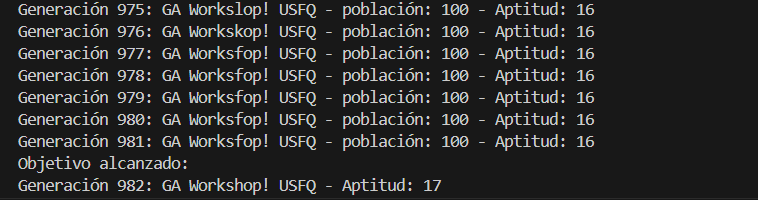
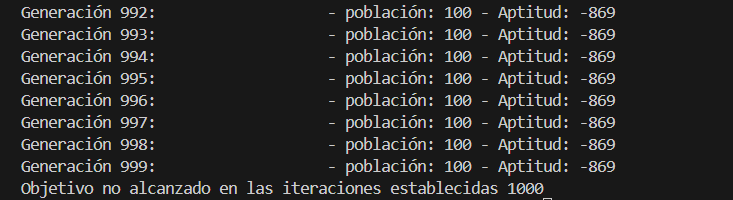
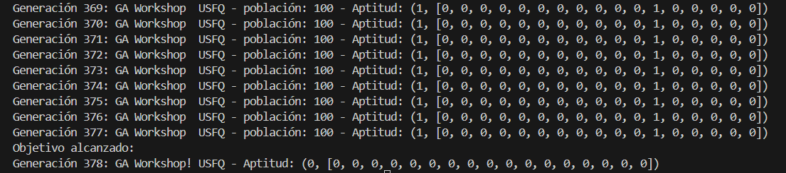
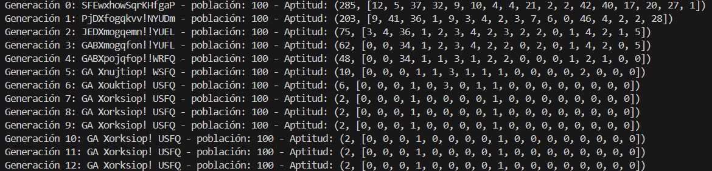

# WorkShop-USFQ
## Taller 4 de inteligencia artificial - Grupo 3.

## 1. Ejecute los dos casos de estudio y explique los resultados de ejecución de cada caso de estudio.

Se ejecutó el caso de estudio 1, utiliza como función de evaluación la cantidad de diferencias entre los caracteres de los individuos con el objetivo. Converge a la solución en la Generación 982.

<div>
    
</div>

Se ejecutó el caso de estudio 2, utiliza como función de evaluación una distancia acumulada de los caracteres UNICODE de los individuos con el objetivo, esta función tiene un problema por lo que no converge a la solución luego de pasar las 1000 generaciones.


<div>
    
</div>

## 2. ¿Cuál sería una posible explicación para que el caso 2 no finalice como lo hace el caso 1? Revisar el archivo util.py función distance.

La función de evaluación no se encuentra de una forma consistente que coopere a las tareas de reproducción y mutación posteriores. Esta función al no administrar correctamente las diferencias de distancias y luego acumularlas no entrega valores adecuados para poder obtener los más y menos aptos para que luego puedan canalizarse a los posteriores procesos, por lo que se sugiere que de la forma actual se generan bucles sin solución o no hay la orientación requerida.

## 3. Realice una correcta implementación para obtener la distancia/diferencia correcta entre dos individuos en el archivo util.py función distance.

La evaluación para crear nuevas generaciones con este método se realiza en función de minimizar la distancia entre las palabras, al contrario del caso 1 que se debía maximizar las coincidencias.

Cabe indicar que para este ejercicio las poblaciones están compuestas por elementos del mismo número de caracteres del objetivo, por lo que no se necesita aumentar las distancias encontradas entre los individuos de la población y el objetivo utilizando esto. Oara este ejercicio, estas líneas de código no se emplean pero se mantienen.

Se corrigió la función de evaluación indicada, se procede a manejar las distancias entre caracteres en valor absoluto para su acumulación ya que son diferencias relativas:

```python
def distance(list1:List[int], list2:List[int]):
    acc = 0
    for e1, e2 in zip(list1, list2):
        #Las diferencias entre los valores unicode de los individuos debe ser absoluta.
        acc += abs(e1 - e2)
    n_size = min(len(list1), len(list2))
    if n_size == 0:
        return None
    return acc + (len(list1) - len(list2)), lista_palabra

``` 
Con esta función la convergencia se optimizó a 378 generaciones para llegar al objetivo:


<div>
    
</div>

A pesar de no contar con una lógica clara que administre la diferencia de "distancias" entre códigos unicode, por lo que se asume que la distancia entre dos palabras es la suma de las diferencias absolutas entre los códigos unicode de los caracteres de las palabras del individuo y el objetivo. Bajo este esquema, con su respetiva parametrización, en comparación al caso 1 se encuentra la solución mucho más rápido: Generación 982 vs. Generación 378.


## 4. ¿Sin alterar el parámetro de mutación mutation_rate, se puede implementar algo para mejorar la convergencia y que esta sea más rápida? Implemente cualquier mejora que permita una rápida convergencia. Pista: ¿Tal vez elegir de manera diferente los padres? ¿Realizar otro tipo de mutación o cruce?

Sin alterar el parámetro de mutación mutation_rate, se procedió a buscar alternativas de mejora y optimización:

* De inicio se intentó mediante la métrica ajustada de distancia encontrar los 50 individuos más aptos, y proceder a reproducirlos en parejas acorde su ranking, los mismos generan un hijo y la población se complementa con 50 individuos nuevos en la población para matenenrla en 100.

``` 
    if _type == ParentSelectionType.NEW:
        
        
        def obtener_individuo_por_posicion(poblacion, aptitudes, pareja):
            # Combinar las listas en una sola para ordenarlas juntas
            combinada = list(zip(population, aptitudes))

            # Ordenar basado en el valor de la primera columna de los datos (i[1][0])
            combinada_ordenada = sorted(combinada, key=lambda i: i[1][0])

            # Descomprimir las listas ordenadas
            nombres_ordenados, aptitudes_ordenadas = zip(*combinada_ordenada)

            # Obtener el individuo en la posición especificada
            individuo_en_posicion = nombres_ordenados[pareja]
            aptitudes_en_posicion = aptitudes_ordenadas[pareja][1]
            
            return individuo_en_posicion, aptitudes_en_posicion

        # Obtener el individuo en la posición especificada
        parent1, aptitudes1 = obtener_individuo_por_posicion(population, aptitudes, 2*pareja)#pareja)#)
        parent2, aptitudes2 = obtener_individuo_por_posicion(population, aptitudes, 2*pareja+1)#99-pareja)#)            
        
        return parent1, parent2, aptitudes1, aptitudes2
``` 

Además, los hijos tendrán los mejores genes de cada padre que se acerquen al objetivo:

``` 
    if _type == CrossoverType.NEW:
        child1=""
        for i in range(len(parent1)):
            if aptitudes1[i] < aptitudes2[i]:
                child1 = child1 + parent1[i]
            else:
                child1 = child1 + parent2[i]
        return child1
``` 
Para lo que se procedió a guardar un registro de las distancias no solo por individuo sino también por gen de cada individuo.

Pero, con esta iniciativa identificamos que aunque rápidamente los individuos casi se ajustan al objetivo (tan solo en 6 generaciones faltan 2 genes para converger al objetivo), el algoritmo se estanca hasta las 1000 generaciones parametrizadas sin llegar al objetivo, por lo que se descarta esta iniciativa. Pero nos perimitió llegar a la conclusión que es indispensable la variabilidad dentro del algoritmo, ya que al especializarse con los aptos en un inicio la convergencia es acelerada pero luego no permite obtener todos los genes requeridos, incluso a largo plazo sin aplicar importantes mutaciones.

<div>
    
</div>


## 5. Cree un nuevo caso de estudio 3. Altere el parámetro de mutación mutation_rate, ¿ha beneficiado en algo la convergencia? Qué valores son los más adecuados para este parámetro. ¿Qué conclusión se puede obtener de este cambio?
Para analizar el cambio del parámetro mutation_rate beneficia la convergencia del algoritmo, se podría comparar la velocidad y estabilidad con la que el algoritmo alcanza el objetivo en comparación con los casos anteriores. Es importante tener en cuenta que no hay un valor de mutation_rate universalmente óptimo; su efecto puede variar según la naturaleza del problema y la configuración del algoritmo genético.
Determinar el valor ideal para el parámetro mutation_rate en un algoritmo genético es un proceso empírico que implica experimentación y ajuste. 
Se pueden utilizar los siguientes enfoques para determinar el valor ideal de este parámetro:
* Prueba y error sistemático 
* Análisis de sensibilidad 
* Comparación con valores estándar
* Análisis de convergencia
* Validación cruzada

Concluyendo, al experimentar con diferentes valores de mutation_rate, se puede observar cómo afecta la convergencia del algoritmo genético. En algunos casos, un valor más alto puede introducir más diversidad y evitar la convergencia prematura, mientras que en otros casos podría resultar en una exploración excesiva y una convergencia más lenta. Es importante ajustar este parámetro según las características específicas del problema que se está abordando.


## 6. Cree un nuevo caso de estudio 4. Altere el tamaño de la población, ¿es beneficioso o no aumentar la población?


## 7. De todo lo aprendido, cree el caso de estudio definitivo (caso de estudio 5) el cual tiene lo mejor de los ítems 4, 5, 6.
